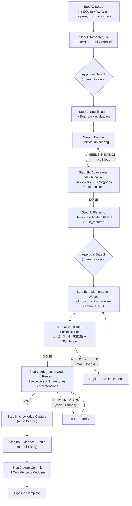

# Deterministic Multi-Agent Pipeline

A 9-agent, evidence-gated pipeline for VS Code GitHub Copilot that delivers deterministic feature development through typed YAML schemas, a SQLite evidence ledger, adversarial multi-perspective review, per-task verification with optional E2E, and risk-driven escalation.

## Overview

Every agent communicates via typed YAML contracts defined in a shared schema reference. All verification evidence is recorded in a SQLite `anvil_checks` ledger. Adversarial reviews dispatch three perspective-diverse instances per round — each covering all three review categories — to catch security, architectural, and correctness issues before code ships. A fast-track entry point is available for small, low-risk changes.

**Key numbers:** 9 agent definitions · 14 typed YAML schemas · 9 reference documents · 2 entry-point prompts

## Architecture

### Full Pipeline Flow


```mermaid
flowchart TD
    S0["Step 0: Setup\nInit SQLite + WAL, git hygiene, pushback check"]
    S1["Step 1: Research ×4\nPattern A — Fully Parallel"]
    AG1{"Approval Gate 1\n(interactive only)"}
    S2["Step 2: Specification\n+ Pushback evaluation"]
    S3["Step 3: Design\n+ Justification scoring"]
    S3b["Step 3b: Adversarial Design Review\n3 reviewers × 3 categories = 9 dimensions"]
    S4["Step 4: Planning\n+ Risk classification 🟢🟡🔴 + e2e_required"]
    AG2{"Approval Gate 2\n(interactive only)"}
    S5["Step 5: Implementation Waves\n≤4 concurrent + baseline capture + TDD"]
    S6["Step 6: Verification\nPer-task: Tier 1→2→3→4→5(E2E) + SQL ledger"]
    S5R["Replan + Re-implement"]
    S7["Step 7: Adversarial Code Review\n3 reviewers × 3 categories = 9 dimensions"]
    S7F["Fix + Re-verify"]
    S8["Step 8: Knowledge Capture\n(non-blocking)"]
    S8b["Step 8b: Evidence Bundle\n(non-blocking)"]
    S9["Step 9: Auto-Commit\n(if Confidence ≥ Medium)"]
    DONE["Pipeline Complete"]

    S0 --> S1
    S1 --> AG1
    AG1 --> S2
    S2 --> S3
    S3 --> S3b
    S3b -- "DONE" --> S4
    S3b -- "NEEDS_REVISION\n(max 1 loop)" --> S3
    S4 --> AG2
    AG2 --> S5
    S5 --> S6
    S6 -- "DONE" --> S7
    S6 -- "NEEDS_REVISION\n(max 3 loops)" --> S5R
    S5R --> S5
    S7 -- "DONE" --> S8
    S7 -- "NEEDS_REVISION\n(max 2 rounds)" --> S7F
    S7F --> S7
    S8 --> S8b
    S8b --> S9
    S9 --> DONE
```

### Fast-Track Pipeline Flow

For small, low-risk (🟢) features only. Invoked via `plan-and-implement.prompt.md`.

```
Step 0 → Step 4 (Planning) → Step 5 (Implementation) →
  Step 6 (Verification) → Step 7 (Code Review) →
  Step 8 (Knowledge) → Step 9 (Auto-Commit)
```

Steps 1–3b (research, spec, design, design review) are skipped. Steps 0, 7, and 9 are **immutable** — they cannot be skipped by any pipeline mode.

## Agent Inventory

| #   | Agent                    | File                            | Pipeline Step              | Key Capability                                                                        |
| --- | ------------------------ | ------------------------------- | -------------------------- | ------------------------------------------------------------------------------------- |
| 1   | **Orchestrator**         | `orchestrator.agent.md`         | All (coordinator)          | Dispatch routing, approval gates, SQL evidence verification, retry & error handling   |
| 2   | **Researcher**           | `researcher.agent.md`           | Step 1 (×4 parallel)       | Codebase investigation across 4 focus areas; optional Context7 + web research        |
| 3   | **Spec**                 | `spec.agent.md`                 | Step 2                     | Feature specification with per-concern interactive pushback system                    |
| 4   | **Designer**             | `designer.agent.md`             | Step 3                     | Technical design with confidence-scored decision justifications                       |
| 5   | **Planner**              | `planner.agent.md`              | Step 4                     | Task decomposition, per-file risk (🟢/🟡/🔴), `e2e_required` flag, wave ordering     |
| 6   | **Implementer**          | `implementer.agent.md`          | Step 5 (≤4 concurrent)     | RED-GREEN-VERIFY TDD cycle, baseline capture, SQL evidence recording, self-fix loop   |
| 7   | **Verifier**             | `verifier.agent.md`             | Step 6 (per-task)          | 5-tier cascade (Tier 5 = E2E), SQL evidence ledger, command audit trail               |
| 8   | **Adversarial Reviewer** | `adversarial-reviewer.agent.md` | Steps 3b & 7 (×3 parallel) | 3 perspectives × 3 categories = 9 review dimensions; Security Blocker halts pipeline |
| 9   | **Knowledge Agent**      | `knowledge-agent.agent.md`      | Steps 8, 8b                | Post-mortem analysis, decisions log, evidence bundle, cross-session memory            |

## Key Features

### SQLite-First Evidence Ledger

All verification evidence is recorded in a SQLite `verification-ledger.db` with WAL mode enabled. The Orchestrator independently verifies gate conditions via SQL queries on `run_id`, `round`, `verdict`, and `severity`. Four tables provide complete pipeline observability:

| Table                  | Purpose                                           |
| ---------------------- | ------------------------------------------------- |
| `anvil_checks`         | Primary verification evidence (per-check records) |
| `pipeline_telemetry`   | Execution tracking per agent dispatch             |
| `artifact_evaluations` | Quality scores for agent-produced outputs         |
| `instruction_updates`  | Governed instruction file change audit trail      |

### Typed YAML Schemas (14 Schemas)

Every agent boundary is governed by a typed YAML schema in `schemas.md`:

| #   | Schema                  | Producer            |
| --- | ----------------------- | ------------------- |
| 1   | `completion-contract`   | All agents          |
| 2   | `research-output`       | Researcher          |
| 3   | `spec-output`           | Spec Agent          |
| 4   | `design-output`         | Designer            |
| 5   | `plan-output`           | Planner             |
| 6   | `task-schema`           | Planner (sub)       |
| 7   | `implementation-report` | Implementer         |
| 8   | `verification-report`   | Verifier            |
| 9   | `review-findings`       | Adversarial Review  |
| 10  | `knowledge-output`      | Knowledge Agent     |
| 11  | `artifact_evaluations`  | SQLite DDL          |
| 12  | `instruction_updates`   | SQLite DDL          |
| 13  | `e2e-contract`          | Project-level config|
| 14  | `e2e-skill`             | Researcher (Step 1.5)|

### 9-Dimension Adversarial Review

Both design (Step 3b) and code (Step 7) dispatch three parallel reviewer instances, each covering all three review categories through a distinct lens:

| Perspective              | Lens                                                        |
| ------------------------ | ----------------------------------------------------------- |
| **security-sentinel**    | Injection, auth bypasses, data exposure, OWASP Top 10       |
| **architecture-guardian**| Coupling, scalability, boundary violations, tech debt       |
| **pragmatic-verifier**   | Edge cases, logic errors, spec compliance, test validity    |

3 perspectives × 3 categories = **9 review dimensions** per round. A Security Blocker from any reviewer halts the pipeline immediately; majority approval (≥2 of 3) is required to continue.

### Per-Task Verifier with 5-Tier Cascade

Each completed task gets its own Verifier dispatch:

1. **Tier 1 — IDE Diagnostics + Syntax:** `get_errors`, syntax/parse verification, baseline cross-check
2. **Tier 2 — Build & Test:** Build, type check, lint, test execution, behavioral coverage (BLOCKING), TDD compliance (BLOCKING)
3. **Tier 3 — Runtime Verification:** Import/load test, smoke execution (mandatory when Tiers 1–2 lack runtime evidence)
4. **Tier 4 — Operational Readiness** *(Large tasks only):* Observability, graceful degradation, secrets scan
5. **Tier 5 — E2E Verification** *(when `e2e_required=true`):* 5 phases — setup, test suite, exploratory, adversarial, teardown — with full command audit trail against an allowlist

`e2e_required` is determined independently of `workflow_lane` and risk level: it activates when an `e2e-contract.yaml` exists **and** the Planner assesses E2E coverage as necessary.

### Risk-Driven Escalation (🟢/🟡/🔴)

The Planner classifies every file change by risk level. 🔴 files trigger Tier 4 verification, influence task sizing (Standard vs. Large), and are highlighted at approval gates. Fast-track mode is restricted to 🟢-only features.

### Context7 Library Documentation Integration

The Researcher (Step 1) and Implementer (Step 5) can query Context7 MCP for up-to-date library and framework documentation. Gracefully degrades if the MCP server is unavailable.

### Evidence Bundle Assembly

The Knowledge Agent assembles `evidence-bundle.md`: overall confidence rating, verification summary, adversarial review summary, rollback command, blast radius, and known issues.

### Interactive Approval Gates

Two approval gates (post-research and post-planning) pause for human review in interactive mode. Autonomous mode skips gates automatically. `APPROVAL_MODE` is authoritative — the pipeline never re-prompts or defaults.

## Getting Started

### Prerequisites

- VS Code with GitHub Copilot agent mode enabled
- Git installed and available on PATH
- (Optional) SQLite CLI for evidence queries

### Usage

#### Full Pipeline — for features requiring research, design, and specification

1. Open VS Code in your project repository.
2. Start a Copilot Chat session in **agent mode**.
3. Invoke the pipeline prompt:

   ```
   @workspace /feature-workflow
   ```

4. Provide your feature request when prompted (`USER_FEATURE` variable).
5. Set `APPROVAL_MODE` to `interactive` (recommended) or `autonomous`.

#### Fast-Track — for small, low-risk (🟢) changes only

```
@workspace /plan-and-implement
```

Skips research, spec, and design. Proceeds directly to planning → implementation → verification → code review → commit. All three immutable steps (0, 7, 9) are always included.

## File Structure

```
.github/
├── agents/
│   ├── orchestrator.agent.md            # Pipeline coordinator (≤550 lines)
│   ├── researcher.agent.md              # Codebase investigation (×4 parallel)
│   ├── spec.agent.md                    # Feature specification + pushback
│   ├── designer.agent.md                # Technical design + justification scoring
│   ├── planner.agent.md                 # Task decomposition + risk classification
│   ├── implementer.agent.md             # TDD implementation + baseline capture
│   ├── verifier.agent.md                # Verification cascade + E2E + evidence ledger
│   ├── adversarial-reviewer.agent.md    # 3-perspective multi-dimension review
│   ├── knowledge-agent.agent.md         # Post-mortem + decisions + evidence bundle
│   │
│   ├── schemas.md                       # 14 typed YAML schemas (all agent I/O)
│   ├── dispatch-patterns.md             # Pattern A (parallel) / B (sequential) definitions
│   ├── severity-taxonomy.md             # Blocker / Critical / Major / Minor definitions
│   ├── sql-templates.md                 # DDL, DML templates, sanitization rules, evidence gates
│   ├── tool-access-matrix.md            # Per-agent tool access rules + Tier 5 allowlist
│   ├── e2e-integration.md               # E2E contract + skill schema + Tier 5 procedures
│   ├── review-perspectives.md           # 3-perspective reviewer configuration
│   ├── evaluation-schema.md             # Artifact quality scoring schema
│   ├── context7-integration.md          # Context7 MCP library docs integration
│   └── global-operating-rules.md        # Cross-agent operating rules (auto-loaded)
│
├── instructions/
│   └── pipeline-conventions.md          # Global pipeline conventions (auto-loaded)
│
└── prompts/
    ├── feature-workflow.prompt.md        # Full pipeline entry point
    └── plan-and-implement.prompt.md      # Fast-track entry point (🟢 only)
```

### Reference Documents

| Document                  | Purpose                                                                                  |
| ------------------------- | ---------------------------------------------------------------------------------------- |
| `schemas.md`              | 14 typed YAML schemas defining every agent I/O contract + 2 SQLite DDL schemas          |
| `dispatch-patterns.md`    | Pattern A (fully parallel) and B (sequential with replan loop) definitions               |
| `severity-taxonomy.md`    | Unified severity levels (Blocker / Critical / Major / Minor) used across all agents      |
| `sql-templates.md`        | Canonical DDL/DML, SQL sanitization rules, evidence gate queries (EG-1 to EG-10)        |
| `tool-access-matrix.md`   | Per-agent tool allowlists, scope restrictions, and Tier 5 command allowlist patterns     |
| `e2e-integration.md`      | E2E contract schema, e2e-skill format, Tier 5 five-phase procedure, concurrency cap      |
| `review-perspectives.md`  | Perspective configuration for security-sentinel, architecture-guardian, pragmatic-verifier |
| `evaluation-schema.md`    | Artifact quality evaluation schema used by Implementer, Verifier, and Knowledge Agent   |
| `context7-integration.md` | Context7 MCP integration guide for Researcher and Implementer                           |
| `global-operating-rules.md` | Cross-agent rules: terminal-first testing, no file-redirect, retry policy, anti-hallucination |
