# Next-Generation Deterministic Multi-Agent Pipeline

A 9-agent, evidence-gated pipeline for VS Code GitHub Copilot that delivers deterministic feature development through typed YAML schemas, a SQLite evidence ledger, adversarial multi-model review, per-task verification, and risk-driven escalation.

## Overview

This system synthesizes the Forge Orchestrator's multi-agent pipeline, the Anvil Agent's evidence-first verification, and article principles (typed schemas, action schemas) into a single deterministic pipeline. Every agent communicates via typed YAML contracts defined in a shared schema reference. All verification evidence is recorded in a SQLite `anvil_checks` ledger, and adversarial reviews use three perspective-diverse models to catch security, architecture, and correctness issues before code ships.

**Key numbers:** 9 agent definitions · 10 typed YAML schemas · 3 shared reference documents · 1 entry-point prompt

## Architecture

### Pipeline Flow

```mermaid
flowchart TD
    S0["Step 0: Setup<br/>Init SQLite + WAL, git hygiene, check prerequisites"]
    S1["Step 1: Research ×4<br/>Pattern A — Fully Parallel"]
    AG1{"Approval Gate 1<br/>(interactive only)"}
    S2["Step 2: Specification<br/>+ Pushback evaluation"]
    S3["Step 3: Design<br/>+ Justification scoring"]
    S3b["Step 3b: Adversarial Design Review<br/>Always 3 reviewers, perspective-diverse"]
    S4["Step 4: Planning<br/>+ Risk classification 🟢🟡🔴"]
    AG2{"Approval Gate 2<br/>(interactive only)"}
    S5["Step 5: Implementation Waves<br/>≤4 concurrent + baseline capture"]
    S6["Step 6: Verification<br/>Per-task: Tier 1→2→3→4 + SQL ledger"]
    S5R["Replan + Re-implement"]
    S7["Step 7: Adversarial Code Review<br/>Always 3 reviewers, perspective-diverse"]
    S7F["Fix + Re-verify"]
    S8["Step 8: Knowledge Capture<br/>(non-blocking)"]
    S8b["Step 8b: Evidence Bundle<br/>(non-blocking)"]
    S9["Step 9: Auto-Commit<br/>(if Confidence ≥ Medium)"]
    DONE["Pipeline Complete"]

    S0 --> S1
    S1 --> AG1
    AG1 --> S2
    S2 --> S3
    S3 --> S3b
    S3b -- "DONE" --> S4
    S3b -- "NEEDS_REVISION<br/>(max 1 loop)" --> S3
    S4 --> AG2
    AG2 --> S5
    S5 --> S6
    S6 -- "DONE" --> S7
    S6 -- "NEEDS_REVISION<br/>(max 3 loops)" --> S5R
    S5R --> S5
    S7 -- "DONE" --> S8
    S7 -- "NEEDS_REVISION<br/>(max 2 rounds)" --> S7F
    S7F --> S7
    S8 --> S8b
    S8b --> S9
    S9 --> DONE
```



### Critical Path

```
Setup → Research → [Approval] → Spec → Design → Design Review →
  Planning → [Approval] → Implementation → Verification →
  Code Review → Knowledge → Auto-Commit → Complete
```

## Agent Inventory

| #   | Agent                    | File                            | Pipeline Step             | Key Capability                                                                 |
| --- | ------------------------ | ------------------------------- | ------------------------- | ------------------------------------------------------------------------------ |
| 1   | **Orchestrator**         | `orchestrator.agent.md`         | All (coordinator)         | Lean dispatch, approval gates, SQL evidence verification, retry orchestration  |
| 2   | **Researcher**           | `researcher.agent.md`           | Step 1 (×4 parallel)      | Focused codebase investigation with typed YAML output                          |
| 3   | **Spec**                 | `spec.agent.md`                 | Step 2                    | Feature specification with pushback system                                     |
| 4   | **Designer**             | `designer.agent.md`             | Step 3                    | Technical design with justification scoring                                    |
| 5   | **Planner**              | `planner.agent.md`              | Step 4                    | Task decomposition with per-file risk classification (🟢/🟡/🔴)                |
| 6   | **Implementer**          | `implementer.agent.md`          | Step 5 (≤4 concurrent)    | TDD implementation + baseline capture + self-fix loop                          |
| 7   | **Verifier**             | `verifier.agent.md`             | Step 6 (per-task)         | 4-tier verification cascade + SQLite evidence ledger                           |
| 8   | **Adversarial Reviewer** | `adversarial-reviewer.agent.md` | Steps 3b, 7 (×3 parallel) | Perspective-diverse multi-model review (security / architecture / correctness) |
| 9   | **Knowledge Agent**      | `knowledge-agent.agent.md`      | Steps 8, 8b               | Knowledge evolution, decision logging, evidence bundle assembly                |

## Key Features

### SQLite-First Evidence Ledger

All verification evidence is recorded in a SQLite `anvil_checks` table with WAL mode enabled. The Orchestrator independently verifies gate conditions via SQL queries filtering on `run_id`, `round`, `verdict`, and `severity`. This provides tamper-resistant, queryable proof of quality at every pipeline stage.

### Typed YAML Schemas (10 Schemas)

Every agent boundary is governed by a typed YAML schema defined in `schemas.md`. Schemas cover research output, spec output, design output, plan output, task definitions, implementation reports, verification reports, review verdicts, knowledge output, and completion contracts.

### 3-Model Adversarial Review

Both design (Step 3b) and code (Step 7) pass through three parallel reviewers with distinct perspectives:

- **Security** — injection, auth, data exposure
- **Architecture** — coupling, scalability, boundaries
- **Correctness** — edge cases, logic errors, spec compliance

A security blocker from any reviewer halts the pipeline. Majority approval (≥2 of 3) is required to proceed.

### Per-Task Verifier with 4-Tier Cascade

Each completed task gets its own Verifier dispatch running tiers sequentially:

1. **Tier 1 — IDE Diagnostics + Syntax:** IDE error check (`get_errors`/`ide-get_diagnostics`), syntax/parse verification
2. **Tier 2 — Build & Test:** Build, type check, lint, test execution (if tooling exists)
3. **Tier 3 — Runtime Verification:** Import/load test, smoke execution (when Tiers 1–2 lack runtime evidence)
4. **Tier 4 — Operational Readiness** (Large tasks only): Observability, degradation handling, secrets scan

### Risk-Driven Escalation (🟢/🟡/🔴)

The Planner classifies every proposed file change by risk level. Red-flagged files trigger deeper verification (Tier 4), influence task sizing (Standard vs. Large), and surface prominently in approval gates.

### Evidence Bundle Assembly

The Knowledge Agent assembles a single `evidence-bundle.md` deliverable containing: overall confidence rating, verification summary, adversarial review summary, rollback command, blast radius, and known issues.

### Interactive Approval Gates

Two approval gates (post-research and post-planning) pause for human review in interactive mode. Autonomous mode skips gates automatically. A lightweight pushback evaluation at Step 0 flags obvious scope issues before any agents are dispatched.

## Getting Started

### Prerequisites

- VS Code with GitHub Copilot agent mode enabled
- Git installed and available on PATH

### Usage

1. Open VS Code in your project repository.
2. Start a Copilot Chat session in **agent mode**.
3. Invoke the pipeline prompt:

   ```
   @workspace /feature-workflow
   ```

4. Provide your feature request when prompted (`USER_FEATURE` variable).
5. Optionally set `APPROVAL_MODE` to `interactive` for human approval gates (default: `autonomous`).

The prompt file at `.github/prompts/feature-workflow.prompt.md` binds to the Orchestrator, which coordinates the full pipeline from research through auto-commit.

## File Structure

```
NewAgents/
├── .github/
│   ├── agents/
│   │   ├── orchestrator.agent.md            # Lean dispatch coordinator
│   │   ├── researcher.agent.md              # Codebase investigation (×4 instances)
│   │   ├── spec.agent.md                    # Feature specification + pushback
│   │   ├── designer.agent.md                # Technical design + justification scoring
│   │   ├── planner.agent.md                 # Task decomposition + risk classification
│   │   ├── implementer.agent.md             # TDD implementation + baseline capture
│   │   ├── verifier.agent.md                # Verification cascade + evidence ledger
│   │   ├── adversarial-reviewer.agent.md    # Multi-model review (parameterized)
│   │   ├── knowledge-agent.agent.md         # Knowledge evolution + decision logging
│   │   ├── schemas.md                       # All 10 typed YAML schemas
│   │   ├── dispatch-patterns.md             # Dispatch Patterns A/B definitions
│   │   └── severity-taxonomy.md             # Blocker/Critical/Major/Minor definitions
│   └── prompts/
│       └── feature-workflow.prompt.md       # Entry point — binds to orchestrator
└── README.md                                # This file
```

### Reference Documents

| Document               | Purpose                                                                             |
| ---------------------- | ----------------------------------------------------------------------------------- |
| `schemas.md`           | 10 typed YAML schemas defining every agent I/O contract                             |
| `dispatch-patterns.md` | Pattern A (parallel), B (sequential with replan loop) dispatch definitions          |
| `severity-taxonomy.md` | Unified severity levels (Blocker / Critical / Major / Minor) used across all agents |

## Design Heritage

This pipeline is the result of synthesizing three systems:

- **Forge Orchestrator** — Provided the multi-agent pipeline structure, research-first methodology, and dispatch coordination patterns. The original 23-agent design was consolidated to 9 through role merging and the elimination of redundant verification and review agents.
- **Anvil Agent** — Contributed the evidence-first verification philosophy, SQLite `anvil_checks` ledger pattern, tiered verification cascade, baseline capture, and git hygiene practices.
- **Article Principles** — Supplied typed-schema-at-every-boundary structural rigor, action schemas, and zero-merge memory model concepts.

The resulting architecture (Direction A Enhanced with D+B Elements) retains Direction A's lean agent count, Direction D's typed-schema rigor, and Direction B's specialized ground-truth verification — while adding always-on adversarial multi-model review as a first-class pipeline stage.
