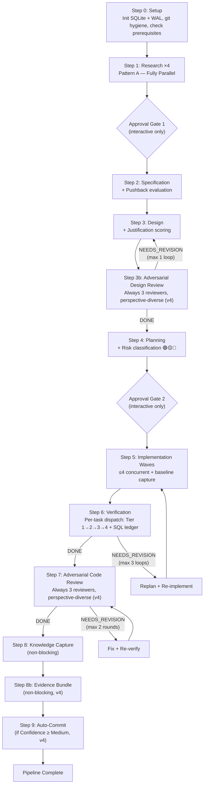

# Design: Next-Gen Multi-Agent System

## Title & Summary

**Feature:** Next-Generation Deterministic Multi-Agent Pipeline for VS Code GitHub Copilot

**Design Goal:** Synthesize the best elements of the Forge Orchestrator (23-agent pipeline), Anvil Agent (evidence-first verification), and article principles (typed schemas, action schemas) into a single deterministic, evidence-gated, risk-aware pipeline with adversarial multi-model review.

**Selected Architecture:** **Direction A Enhanced with D's structural rigor and B's specialized verification** — a lean pipeline using Direction A's agent count and zero-merge memory model, enhanced with Direction D's typed-schema-at-every-boundary structural guidance, plus Direction B's retention of specialized ground-truth verification. Final agent count: **9 unique definitions**.

> **Revision Note (v2 — CT Revision):** This design has been revised following Critical Thinking review. Key changes: (1) pipeline manifest removed as orchestrator file output — state tracked in-context only, (2) schema validation honestly characterized as prompt-level structural guidance rather than machine enforcement, (3) orchestrator responsibilities reduced from 9 to 3, (4) Verifier dispatched per-task not per-wave to bound context, (5) YAML-primary verification ledger replacing SQL-primary, (6) task-context mechanism to address read amplification, (7) schemas reduced from 14 to 10 with evolution strategy, (8) honest characterization of COUNT-based evidence gating limitations. See §CT Revision Log for full details.

> **Revision Note (v3 — SQLite & Adversarial Review Corrections):** Two major corrections applied. (1) **SQLite first-class:** The v2 design incorrectly assumed `run_in_terminal` was forbidden for orchestrator. It IS available to all agents. SQLite is file-based (Windows, no server) and is now the PRIMARY verification ledger using Anvil's `anvil_checks` schema pattern. Orchestrator independently verifies evidence via `run_in_terminal` SQL queries. Pipeline telemetry stored in SQLite. YAML retained for agent I/O schemas, Markdown for agent defs and docs. (2) **Adversarial review simplified:** Always 3 parallel reviewers (gpt-5.3-codex, gemini-3-pro-preview, claude-opus-4.6) — no risk-driven reviewer count variance. Each writes findings to a separate Markdown file. Max 2 rounds. Placed after design phase. See §v3 Revision Log for full details.

> **Revision Note (v4 — Adversarial Review Response):** This design has been revised following 3-model adversarial review (gpt-5.3-codex, gemini-3-pro-preview, claude-opus-4.6). 17 findings addressed (6 Critical, 11 High). Key changes: (1) `anvil_checks` schema expanded with `verdict`, `severity`, `round`, `run_id` columns — enables security blocker detection via SQL and stale-record filtering, (2) SQLite WAL mode + busy_timeout mandated in centralized Step 0 initialization, (3) Deviation Records added for FR-1.6 (`run_in_terminal`) and FR-5.3/CR-4 (always-3 reviewers), (4) multi-model routing honestly acknowledged as unverified — perspective-diverse prompts as primary fallback, (5) baseline cross-check fixed via mandatory `git tag` before implementation, (6) evidence gate queries corrected with `verdict`/`round` filters, (7) Adversarial Reviewer now produces typed YAML verdict summary, (8) Evidence Bundle assembly added as Step 8b, (9) Implementer gains self-fix loop + git staging, (10) Verifier Tier 4 operational readiness added, (11) FR-4.7 revert assigned to Implementer, (12) lightweight pushback added at Step 0, (13) git hygiene checks added to Setup. See §v4 Revision Log for full details.

---

## Context & Inputs

### Source Artifacts Consumed

| Artifact                                             | Key Sections Used                                                                                                                                                                                                                                   |
| ---------------------------------------------------- | --------------------------------------------------------------------------------------------------------------------------------------------------------------------------------------------------------------------------------------------------- |
| [feature.md](feature.md)                             | §Architectural Directions (all 5), §Comparison Matrix, §Common Requirements (CR-1–15), §Functional Requirements (FR-1–9), §Non-Functional Requirements (NFR-1–7), §Acceptance Criteria (AC-1–15), §Edge Cases (EC-1–10), §Constraints & Assumptions |
| [initial-request.md](initial-request.md)             | §Requirements, §Anvil Features, §Constraints, §Article Key Principles                                                                                                                                                                               |
| [research/architecture.md](research/architecture.md) | §Forge Orchestrator Architecture, §Anvil Agent Architecture, §Forge Memory Architecture                                                                                                                                                             |
| [research/impact.md](research/impact.md)             | §Forge Agent Inventory, §Anvil Components Impact, §Memory System Impact, §Agent Count Impact Summary                                                                                                                                                |
| [research/dependencies.md](research/dependencies.md) | §Forge Agent Data Flow Graph, §Article Design Principles as Dependency Constraints                                                                                                                                                                  |
| [research/patterns.md](research/patterns.md)         | §Completion Contracts, §Cluster Dispatch Patterns, §Memory Patterns, §Verification Cascade, §SQL Ledger, §Adversarial Review, §Reusable Patterns, §Anti-Patterns                                                                                    |

### Upstream Memory Insights

- **Spec:** 5 directions defined; architectural selection explicitly deferred to designer; YAML specified as SQL fallback; unified severity taxonomy mandated
- **Research-Architecture:** Forge = 23 agents, 8 steps, 3 dispatch patterns, dual-layer memory; Anvil = 1 agent, 12 phases, SQL ledger, adversarial review
- **Research-Impact:** CT cluster = primary restructuring target (50% prompt duplication, 3-iteration bottleneck, 12 dispatches); R cluster partially replaceable; memory system creates ~20+ files with ~12 merges
- **Research-Dependencies:** Neither system implements typed schemas at agent boundaries; memory systems are incompatible; verification overlap is partial
- **Research-Patterns:** Forge's prose verification vs. Anvil's SQL evidence; anti-patterns include excessive memory merge, inconsistent severity, prose where data would be more reliable

---

## Decision 1: Architecture Selection 🟡

### Evaluation of All 5 Directions

#### Direction A: Lean Pipeline — Score: 7.5/10

| Dimension          | Assessment                                                                                            |
| ------------------ | ----------------------------------------------------------------------------------------------------- |
| Agent count (6-8)  | Excellent — minimal orchestration overhead                                                            |
| Memory model       | Excellent — no merge operations, typed outputs ARE the state                                          |
| Schema enforcement | Medium — typed YAML but no explicit validation layer                                                  |
| Verification       | Risk — unified verifier is complex, may hit context limits                                            |
| Specialization     | Risk — adversarial reviewer handles both design and code review (acceptable since it's parameterized) |
| r-knowledge        | Risk — lost unless explicitly preserved                                                               |

#### Direction B: Forge-Plus — Score: 6.5/10

| Dimension           | Assessment                                                |
| ------------------- | --------------------------------------------------------- |
| Migration risk      | Lowest — evolutionary path                                |
| Agent count (12-14) | Too high — doesn't address orchestration overhead problem |
| Memory model        | Partial fix — reduces merges but doesn't eliminate them   |
| Schema enforcement  | Weak — hybrid YAML+Markdown causes confusion              |
| Verification        | Good — retains specialized V-Build/V-Tests                |
| CT replacement      | Good — adversarial reviewer replaces CT cluster           |

#### Direction C: Anvil-Core — Score: 4/10

| Dimension          | Assessment                                                  |
| ------------------ | ----------------------------------------------------------- |
| Agent count (4-6)  | Too aggressive — mega-agents risk context window overflow   |
| SQL dependency     | Hard risk — not all environments have SQLite                |
| Parallelism        | Poor — per-task sequential loop limits throughput           |
| Research quality   | Risk — combined Researcher-Spec may produce weaker research |
| Verification rigor | Excellent — full Anvil cascade per task                     |

#### Direction E: Event-Driven — Score: 3.5/10

| Dimension        | Assessment                                                                  |
| ---------------- | --------------------------------------------------------------------------- |
| Flexibility      | Theoretical maximum but unnecessary for this use case                       |
| Complexity       | Highest — state machine bugs cause infinite loops or deadlocks              |
| Runtime fit      | Poor — VS Code Copilot agent framework is fundamentally sequential          |
| Over-engineering | High — event-driven model for a system that runs one conversation at a time |
| Testing          | Hard — state machine combinatorics create large test surface                |

#### Direction D: Hybrid Typed — Score: 8/10

| Dimension          | Assessment                                                                        |
| ------------------ | --------------------------------------------------------------------------------- |
| Schema rigor       | Excellent — typed schemas at every boundary, article principles fully implemented |
| Agent count (8-10) | Good — reasonable specialization without over-engineering                         |
| Verification       | Good — SQL or YAML with formal schema for each tier                               |
| Extensibility      | Excellent — clear contracts enable agent-level updates                            |
| Risk               | Schema design complexity upfront; some outputs resist strict typing               |

### Selected Approach: Direction A Enhanced with D+B Elements

**Decision:** Start from Direction A's lean pipeline as the architectural base, enhanced with structural rigor from D and selective specialization from B:

| Element                              | Source Direction | Rationale                                                                                           |
| ------------------------------------ | ---------------- | --------------------------------------------------------------------------------------------------- |
| Lean agent count (~9)                | A                | Minimizes orchestration overhead; eliminates the CT 12-dispatch bottleneck                          |
| Zero-merge memory model              | A                | Typed agent outputs replace memory files; eliminates ~12 merge operations per run                   |
| Typed YAML schemas at every boundary | D                | Structural consistency for agent outputs; clear field contracts between agents                      |
| Agent self-validation                | D (adapted)      | Each agent validates its own output structure; prompt-level, not machine-enforced                   |
| Separate Verifier agent              | B                | Ground-truth verification (build, tests) is too important to fold into Implementer                  |
| R-Knowledge retention                | B                | Unique capability with no equivalent in Anvil; knowledge evolution is a distinct concern            |
| Pipeline structure                   | A (modified)     | Deterministic step sequence with typed outputs; no event-driven complexity                          |
| SQL-primary verification ledger      | Anvil (adapted)  | SQLite first-class via `run_in_terminal`; Anvil's `anvil_checks` schema; COUNT-based evidence gates |

**Alternatives rejected:**

| Alternative                    | Rejection Rationale                                                                                                                                | Confidence |
| ------------------------------ | -------------------------------------------------------------------------------------------------------------------------------------------------- | ---------- |
| Direction C (Anvil-Core)       | Mega-agents create context window fragility; per-task serial loop limits parallelism; SQLite concern resolved in v3 (file-based, no server needed) | High       |
| Direction E (Event-Driven)     | Over-engineering for a sequential agent framework; state machine complexity without proportional benefit; hardest to test and debug                | High       |
| Direction B (Forge-Plus, pure) | Doesn't address root problems: memory merge overhead, prose communication, partial schema adoption; higher agent count than necessary              | Medium     |
| Direction A (Lean, pure)       | Unified verifier too complex; loss of r-knowledge not acceptable; insufficient schema rigor compared to D                                          | Medium     |

**Risk classification: 🟡** — The synthesized approach has Medium risk. Schema design complexity and the implementation effort of typed boundaries are the primary risks. Mitigated by: starting with minimal schemas and iterating, using YAML (familiar format), and having clear schema definitions in a reference document.

---

## Decision 2: Agent Inventory 🟢

### Final Agent List: 9 Unique Definitions

| #   | Agent                    | Role                                                                                           | Source                                                                          | Key Enhancement                                                                                                                                                      |
| --- | ------------------------ | ---------------------------------------------------------------------------------------------- | ------------------------------------------------------------------------------- | -------------------------------------------------------------------------------------------------------------------------------------------------------------------- |
| 1   | **Orchestrator**         | Lean dispatch coordinator; routing, approval gates, evidence verification, retry orchestration | Forge (restructured)                                                            | Reduced to 4 core responsibilities (dispatch, approval, evidence verification via SQL, retry); no file writes; no schema validation (moved to agent self-validation) |
| 2   | **Researcher**           | Focused codebase investigation; 1 definition, 4 parallel instances                             | Forge (enhanced)                                                                | Typed YAML output schema; structured findings format                                                                                                                 |
| 3   | **Spec**                 | Feature specification with pushback system                                                     | Forge + Anvil pushback                                                          | Pushback gate; typed YAML output; structured requirements format                                                                                                     |
| 4   | **Designer**             | Technical design with decision justifications                                                  | Forge (enhanced)                                                                | Typed YAML output; justification scoring for decisions                                                                                                               |
| 5   | **Planner**              | Task decomposition with per-file risk classification                                           | Forge (enhanced)                                                                | Risk classification (🟢/🟡/🔴); task sizing (Standard/Large); typed task schemas                                                                                     |
| 6   | **Implementer**          | TDD implementation + documentation + baseline capture                                          | Forge Implementer + Doc Writer + Anvil baseline                                 | Baseline capture before changes; merged doc-writer capability; typed implementation report                                                                           |
| 7   | **Verifier**             | Unified verification cascade + SQL evidence ledger                                             | V-Build + V-Tests + V-Feature (merged) + Anvil cascade                          | Tiered cascade; SQL evidence ledger (Anvil `anvil_checks` schema); regression detection via baseline comparison                                                      |
| 8   | **Adversarial Reviewer** | Parameterized multi-model review (design OR code); always 3 parallel                           | Anvil adversarial review (replaces CT cluster + R-Quality/R-Security/R-Testing) | Always 3 parallel reviewers; separate Markdown findings per model; SQL INSERT of verdicts; security blocker policy                                                   |
| 9   | **Knowledge Agent**      | Knowledge evolution, decision logging, cross-session learning                                  | R-Knowledge (retained) + Anvil Learn step                                       | Non-blocking; typed output; governed instruction updates; append-only decision log                                                                                   |

### Agents Removed (with justification)

| Removed Agent        | Replacement                                            | Justification                                                                                                                   |
| -------------------- | ------------------------------------------------------ | ------------------------------------------------------------------------------------------------------------------------------- |
| ct-security          | Adversarial Reviewer (gpt-5.3-codex or model-specific) | Anvil's multi-model diversity provides genuinely different perspectives vs. same-model-different-prompt                         |
| ct-scalability       | Adversarial Reviewer                                   | Narrow scope subsumed by comprehensive design review with 1-3 models                                                            |
| ct-maintainability   | Adversarial Reviewer                                   | ~50% shared prompt content with siblings; concerns folded into general review                                                   |
| ct-strategy          | Adversarial Reviewer                                   | Broadest CT agent; its "Is this the right approach?" question is exactly what adversarial review answers                        |
| critical-thinker     | (already deprecated)                                   | Remove entirely                                                                                                                 |
| v-tasks              | Verifier                                               | Task-level acceptance criteria verification folded into unified cascade                                                         |
| v-feature            | Verifier                                               | Feature-level acceptance criteria verification folded into unified cascade; regression check integrated via baseline comparison |
| v-build              | Verifier                                               | Build gate integrated as Tier 2 step 1 in unified cascade (sequential gate logic preserved internally)                          |
| v-tests              | Verifier                                               | Test execution integrated as Tier 2 step 4 in unified cascade                                                                   |
| r-quality            | Adversarial Reviewer                                   | Same-model code quality review replaced by multi-model adversarial review                                                       |
| r-security           | Adversarial Reviewer                                   | Security scanning replaced; security blocker policy elevated to pipeline-level rule                                             |
| r-testing            | Adversarial Reviewer                                   | Test quality review replaced by multi-model adversarial review                                                                  |
| documentation-writer | Implementer                                            | Low utilization; doc-type tasks handled by Implementer with `task_type: documentation` parameter                                |
| post-mortem          | Knowledge Agent (partial)                              | Retrospective metrics folded into Knowledge Agent's learning step; telemetry written by Knowledge Agent                         |

### Agent Detail: Inputs, Outputs, Tools

#### 1. Orchestrator

- **Inputs:** `initial-request.md`, all upstream agent outputs (typed YAML)
- **Outputs:** None (orchestrator writes no files — all state is in-context only; dispatch decisions communicated via `runSubagent`)
- **Tools:** `agent`, `agent/runSubagent`, `memory` (VS Code store), `read_file`, `list_dir`, `run_in_terminal`, `get_terminal_output`
- **Tool restrictions:** MUST NOT use `create_file`, `replace_string_in_file`, `grep_search`, `semantic_search`, `file_search`, `get_errors`
- **Core responsibilities (5 — updated v4):**
  1. **Dispatch routing** — read agent completion contracts, determine next step, dispatch appropriate agent(s)
  2. **Approval gate management** — present structured prompts in interactive mode, auto-proceed in autonomous mode
  3. **Error categorization and retry** — classify agent failures (transient vs. deterministic), retry transient once, escalate otherwise
  4. **Evidence gate verification (v3)** — independently verify verification evidence via `run_in_terminal` SQLite queries on the verification ledger
  5. **Pipeline initialization (v4)** — Step 0 SQLite schema creation, WAL mode setup, git hygiene checks, lightweight pushback evaluation
- **`run_in_terminal` constraint (v4 — Deviation Record DR-1):** The orchestrator uses `run_in_terminal` ONLY for: (a) SQLite read queries on the verification ledger (`SELECT`), (b) SQLite DDL for initialization at Step 0 (`CREATE TABLE`, `PRAGMA`), (c) Git read operations (`git status`, `git rev-parse`, `git show`, `git tag`), (d) Git staging/commit (`git add`, `git commit`) at Step 9. It MUST NOT use `run_in_terminal` for builds, tests, code execution, or file modification. This deliberate divergence from FR-1.6 is documented in §Deviation Records.
- **Explicitly NOT responsible for** (moved to other agents per CT revision):
  - Schema validation → each agent self-validates before returning (see Self-Verification in agent template)
  - Risk assessment for reviewer count → N/A in v3 (always 3 reviewers)
  - Pipeline state file → eliminated; orchestrator tracks state in-context across its conversation
  - Telemetry accumulation → Knowledge Agent reads all pipeline outputs at Step 8; pipeline telemetry written to SQLite by each agent
- **Pipeline state recovery (EC-5):** On resume, orchestrator scans feature directory with `list_dir` + `read_file` to discover which agent outputs already exist at deterministic paths. Existing outputs = completed steps.
- **Completion contract:** DONE | ERROR (orchestrator never returns NEEDS_REVISION — handles revision routing internally)

#### 2. Researcher (×4)

- **Inputs:** `initial-request.md`, codebase
- **Outputs:** `research/<focus>.yaml` (typed research schema), `research/<focus>.md` (human-readable companion)
- **Tools:** `read_file`, `list_dir`, `grep_search`, `semantic_search`, `file_search`
- **Tool restrictions:** Read-only. MUST NOT modify any files except writing its own outputs.
- **Completion contract:** DONE | ERROR

#### 3. Spec

- **Inputs:** All research outputs (typed YAML), `initial-request.md`
- **Outputs:** `spec-output.yaml` (typed requirements schema), `feature.md` (human-readable)
- **Tools:** `read_file`, `list_dir`, `grep_search`, `semantic_search`, `file_search`, `create_file`, `replace_string_in_file`, `ask_questions` (for pushback in interactive mode — presents multiple-choice concerns to user)
- **Completion contract:** DONE | ERROR

#### 4. Designer

- **Inputs:** `spec-output.yaml`, all research outputs (typed YAML), `initial-request.md`, adversarial review verdicts (if revision mode)
- **Outputs:** `design-output.yaml` (typed design schema with justification scores), `design.md` (human-readable)
- **Tools:** `read_file`, `list_dir`, `grep_search`, `semantic_search`, `file_search`, `create_file`, `replace_string_in_file`
- **Completion contract:** DONE | ERROR

#### 5. Planner

- **Inputs:** `design-output.yaml`, `spec-output.yaml`, adversarial design review verdicts
- **Outputs:** `plan-output.yaml` (typed task schema with risk classifications and `overall_risk_summary`), `plan.md` (human-readable), `tasks/*.yaml` (per-task typed schemas with `relevant_context` pointers)
- **Tools:** `read_file`, `list_dir`, `grep_search`, `semantic_search`, `file_search`, `create_file`, `replace_string_in_file`
- **Completion contract:** DONE | NEEDS_REVISION (replan mode) | ERROR

#### 6. Implementer (×N)

- **Inputs:** Assigned task file (`tasks/<task-id>.yaml` including `relevant_context` pointers), targeted sections of `design-output.yaml` and `spec-output.yaml` (as listed in task's `relevant_context`)
- **Outputs:** Code/test/doc files, `implementation-reports/<task-id>.yaml` (typed implementation report with baseline records)
- **Tools:** `read_file`, `list_dir`, `grep_search`, `semantic_search`, `file_search`, `create_file`, `replace_string_in_file`, `multi_replace_string_in_file`, `run_in_terminal`, `get_terminal_output`, `get_errors`, `list_code_usages`
- **Baseline responsibility:** Before making changes, capture IDE diagnostics + build + test state and record as `phase: baseline` in implementation report
- **Completion contract:** DONE | ERROR

#### 7. Verifier (dispatched per-task, not per-wave)

- **Inputs:** Single implementation report (`implementation-reports/<task-id>.yaml`), task-relevant sections of `plan-output.yaml` and `spec-output.yaml`, verification ledger, codebase, `run_id` (from orchestrator context)
- **Outputs:** `verification-reports/<task-id>.yaml` (typed verification schema with evidence gate summary), SQL verification ledger entries (PRIMARY — `anvil_checks` table)
- **Tools:** `read_file`, `list_dir`, `grep_search`, `file_search`, `run_in_terminal`, `get_terminal_output`, `get_errors`, `ide-get_diagnostics`
- **Tool restrictions:** Read-only for source code. Can execute build/test commands but MUST NOT modify source files.
- **Verification cascade (v4 — H11):**
  - Tier 1: IDE diagnostics, syntax checks
  - Tier 2: Build, type check, lint, tests
  - Tier 3: Import/load, smoke execution
  - Tier 4 (v4 — Large tasks only): Operational Readiness — observability hooks present, graceful degradation paths tested, no hardcoded secrets (`check_name='readiness-{type}'`)
- **Per-task dispatch:** Dispatched once per task (not per wave) to bound context to ~8 tool call outputs per dispatch (1 task × ~8 checks) instead of 32+ per wave. See §CT Revision Log, Finding #5.
- **Evidence gate summary:** Each verification report includes `evidence_gate: { total_checks: N, passed: N, failed: N, gate_status: passed | failed }` so the orchestrator can route by reading a single field. The orchestrator ALSO independently verifies via `run_in_terminal` SQL query (v4 corrected — C6): `SELECT COUNT(*) FROM anvil_checks WHERE task_id='{task_id}' AND run_id='{run_id}' AND phase='after' AND passed=1;`
- **Baseline cross-check (v4 — C5):** Verifier uses `git show pipeline-baseline-{run_id}:<path>` to inspect pre-implementation file state and compares against Implementer-reported baseline data. This replaces the v3 approach of re-running Tier 1 on baseline files (which was impossible since the Verifier sees post-implementation state).
- **SQL auto-detection:** Verifier uses `CREATE TABLE IF NOT EXISTS` as a safety net; primary initialization happens in Step 0. SQLite is file-based and requires no server installation on Windows.
- **Completion contract:** DONE | NEEDS_REVISION | ERROR

#### 8. Adversarial Reviewer (parameterized) (v4 — H1/H5)

- **Inputs:** Review scope (`design` or `code`), artifacts to review, verification evidence, `run_id`, `round` (from orchestrator context)
- **Outputs:**
  - `review-findings/<scope>-<model>.md` (Markdown findings file — one per model, human-readable)
  - `review-verdicts/<scope>.yaml` (v4 — H1): Machine-readable YAML verdict summary per reviewer:
    ```yaml
    reviewer_model: "gpt-5.3-codex"
    review_focus: "security" # v4 — H5
    scope: "design" # design | code
    verdict: "approve" # approve | needs_revision | blocker
    findings_count: { blocker: 0, critical: 1, high: 3, medium: 5, low: 2 }
    summary: "No security blockers. 1 critical auth concern in token handling."
    ```
  - SQL INSERT of verdict records into `anvil_checks` with `phase='review'`, `run_id`, `round`, `verdict`, `severity`
- **Dispatch parameters:**
  - `review_scope` (design | code)
  - `model` (gpt-5.3-codex | gemini-3-pro-preview | claude-opus-4.6)
  - `review_focus` (v4 — H5): security | architecture | correctness — ensures perspective diversity even when same model is used
  - ALWAYS dispatched as 3 parallel instances with distinct `review_focus` values
- **Focus area details (v4):**
  - `security`: injection vectors, authentication gaps, data exposure, secrets, authorization bypass
  - `architecture`: coupling, scalability boundaries, component responsibilities, API surface area
  - `correctness`: edge cases, logic errors, spec compliance, testing gaps, error handling
- **Tools:** `read_file`, `list_dir`, `grep_search`, `semantic_search`, `file_search`, `run_in_terminal` (for `git diff --staged` in code review mode and SQL INSERT), `create_file` (for verdict YAML)
- **Tool restrictions:** Read-only for existing files. May only create its own verdict output files.
- **Completion contract:** DONE | ERROR

#### 9. Knowledge Agent

- **Inputs:** All pipeline outputs (typed YAML), implementation reports, verification evidence, review verdicts, `git diff`
- **Outputs:** `knowledge-output.yaml` (typed knowledge schema), `decisions.yaml` (append-only decision log updates)
- **Tools:** `read_file`, `list_dir`, `grep_search`, `semantic_search`, `file_search`, `create_file`, `replace_string_in_file`, `memory` (VS Code `store_memory`)
- **Non-blocking:** ERROR from this agent does not halt the pipeline
- **Governed updates:** Instruction file modifications require explicit approval in interactive mode; logged in autonomous mode
- **Completion contract:** DONE | ERROR

**Risk classification: 🟢** — Agent inventory is well-defined with clear roles. 9 definitions is within the 4-15 range (AC-2). Each agent has a single responsibility. The Verifier is the most complex agent — complexity is managed by per-task dispatch (bounded context per invocation) rather than claiming "bounded scope." The orchestrator has 5 responsibilities (v4: added run_in_terminal constraint, SQLite init, git hygiene, pushback) — lean enough to avoid the god-agent pattern while enabling independent evidence verification.

---

## Decision 3: Pipeline Structure 🟢

### Pipeline Overview

```
Step 0: Setup (v4 — expanded)
  ├── Check prerequisites (git, build tools, VS Code tools)
  ├── Git hygiene check (v4 — H10): `git status --porcelain` for dirty state,
  │   `git rev-parse --abbrev-ref HEAD` to verify not on main for non-trivial changes
  ├── Lightweight pushback evaluation (v4 — H4): Orchestrator evaluates initial-request.md
  │   for obvious scope/conflict issues BEFORE dispatching researchers.
  │   Interactive mode → present concerns via `ask_questions` multiple-choice (user chooses: proceed, modify, or abandon).
  │   Autonomous mode → log concerns and proceed. Pushback never autonomously halts the pipeline.
  ├── Generate run_id (ISO8601 timestamp, e.g., '2026-02-26T14:30:00Z')
  ├── SQLite initialization (v4 — C2/H7): Orchestrator executes via `run_in_terminal`:
  │   PRAGMA journal_mode=WAL; PRAGMA busy_timeout=5000;
  │   CREATE TABLE IF NOT EXISTS anvil_checks (...); CREATE TABLE IF NOT EXISTS pipeline_telemetry (...);
  │   CREATE INDEX IF NOT EXISTS idx_anvil_task_phase ...; (see §Decision 6 for full SQL)
  ├── Load schema definitions
  ├── Scan feature directory for existing outputs (resume support, EC-5)
  └── Orchestrator begins tracking pipeline state in-context (incl. run_id)

Step 1: Research ×4 (Pattern A — Fully Parallel)
  ├── Dispatch: researcher ×4 with focus areas (architecture, impact, dependencies, patterns)
  ├── Concurrency: 4 concurrent (within cap)
  ├── Gate: ≥2 of 4 must return DONE
  ├── Retry: Failed researchers retried once
  └── Output: 4 typed YAML research outputs

Step 1a: [APPROVAL GATE — interactive mode only]
  ├── Present: Research summary + approval options
  └── Auto-proceed in autonomous mode

Step 2: Specification (Sequential)
  ├── Dispatch: spec agent
  ├── Input: All research outputs + initial-request
  ├── Pushback evaluation: Surfaces concerns via `ask_questions` (interactive) or logs (autonomous); never halts autonomously
  └── Output: spec-output.yaml + feature.md

Step 3: Design (Sequential)
  ├── Dispatch: designer agent
  ├── Input: spec-output.yaml + research outputs
  └── Output: design-output.yaml + design.md

Step 3b: Adversarial Design Review (Always 3 Reviewers — v4)
  ├── Dispatch: adversarial-reviewer ×3 in parallel with distinct review_focus (v4 — H5):
  │   Reviewer 1 (gpt-5.3-codex): review_focus='security' (injection, auth, data exposure)
  │   Reviewer 2 (gemini-3-pro-preview): review_focus='architecture' (coupling, scalability, boundaries)
  │   Reviewer 3 (claude-opus-4.6): review_focus='correctness' (edge cases, logic errors, spec compliance)
  ├── Each reviewer writes: Markdown findings + YAML verdict summary (v4 — H1)
  ├── Each reviewer INSERTs verdict into SQLite with run_id, round, verdict, severity
  ├── Evidence gate (v4): Orchestrator SQL checks:
  │   (a) All 3 submitted: COUNT WHERE round={r} AND verdict IS NOT NULL >= 3
  │   (b) No blockers: COUNT WHERE verdict='blocker' = 0
  │   (c) Majority approve: COUNT WHERE verdict='approve' >= 2
  ├── If NEEDS_REVISION → round++ → back to Step 3 (max 1 design revision loop)
  └── Output: review-findings/design-*.md + review-verdicts/design.yaml + SQL records

Step 4: Planning (Sequential)
  ├── Dispatch: planner agent
  ├── Input: design-output.yaml + spec-output.yaml + design review verdicts
  ├── Risk classification: Per-file 🟢/🟡/🔴 for every proposed change
  ├── Task sizing: Standard (no 🔴) or Large (any 🔴)
  └── Output: plan-output.yaml + plan.md + tasks/*.yaml

Step 4a: [APPROVAL GATE — interactive mode only]
  ├── Present: Task breakdown + risk classifications + approval options
  └── Auto-proceed in autonomous mode

Step 5-6: Implementation + Verification Loop (max 3 iterations)
  │
  ├── Pre-implementation: Orchestrator creates git tag `pipeline-baseline-{run_id}` (v4 — C5)
  │
  ├── Step 5: Implementation Wave (≤4 concurrent implementers)
  │   ├── Each implementer: baseline capture → TDD implementation → self-fix loop (v4 — H3)
  │   │   Self-fix loop: run IDE diagnostics + build + tests; if fail, fix immediately
  │   │   (max 2 self-fix attempts within Implementer context before returning)
  │   ├── After self-fix: `git add -A` to stage changes (v4 — H8)
  │   ├── Sub-wave partitioning if >4 tasks
  │   ├── Output: code/test files + implementation-reports/<task-id>.yaml
  │   └── Evidence: baseline records in implementation reports
  │
  ├── Step 6: Verification (per-task dispatch — one Verifier per completed task)
  │   ├── Each Verifier: full tiered cascade for ONE task (Tier 1 → Tier 2 → Tier 3 → Tier 4)
  │   ├── Tier 4 (v4 — H11): Operational Readiness (Large tasks only) — observability,
  │   │   degradation handling, secrets scan. INSERTs `check_name='readiness-{type}'`
  │   ├── Evidence recording: All checks → SQLite `anvil_checks` table (PRIMARY) via `run_in_terminal`
  │   ├── Baseline cross-check (v4): Verifier uses `git show pipeline-baseline-{run_id}:<path>`
  │   │   to independently verify Implementer baseline claims (replaces v3 re-run approach)
  │   ├── Per-task evidence gate: Each Verifier reports `gate_status: passed | failed` in its output
  │   ├── Orchestrator independently verifies via SQL (v4 corrected queries with run_id/round)
  │   ├── Acceptance criteria verification against spec (task-relevant criteria only)
  │   └── Output: verification-reports/<task-id>.yaml + SQL ledger entries
  │
  ├── If any task NEEDS_REVISION → Planner (replan mode) → back to Step 5
  └── Max 3 iterations; after 3 → proceed with findings documented, Confidence: Low

Step 7: Adversarial Code Review (Always 3 Reviewers — v4)
  ├── Dispatch: adversarial-reviewer ×3 in parallel with distinct review_focus (v4 — H5):
  │   Reviewer 1 (gpt-5.3-codex): review_focus='security' (injection, auth, data exposure)
  │   Reviewer 2 (gemini-3-pro-preview): review_focus='architecture' (coupling, scalability, boundaries)
  │   Reviewer 3 (claude-opus-4.6): review_focus='correctness' (edge cases, logic errors, testing gaps)
  ├── Input: git diff --staged, verification evidence, implementation reports
  ├── Each reviewer writes: Markdown findings + YAML verdict summary (v4 — H1)
  ├── Evidence gate (v4 corrected): Orchestrator SQL checks verdict='approve'/round/run_id
  ├── Security blocker policy: Any verdict='blocker' from ANY model → pipeline ERROR (SQL-detectable)
  ├── If NEEDS_REVISION → Implementer fixes → re-verify → re-review (max 2 rounds, round++)
  ├── After 2 rounds: remaining findings → known issues, Confidence: Low
  └── Output: review-findings/code-*.md + review-verdicts/code.yaml + SQL records

Step 8: Knowledge Capture (Non-blocking)
  ├── Dispatch: knowledge-agent
  ├── Input: All pipeline outputs, telemetry, review verdicts
  ├── Non-blocking: ERROR does not halt pipeline
  └── Output: knowledge-output.yaml + decisions.yaml updates + store_memory calls

Step 8b: Evidence Bundle Assembly (v4 — H2)
  ├── Responsibility: Knowledge Agent (as final sub-step of Step 8)
  ├── Assembles coherent proof-of-quality deliverable from scattered pipeline outputs:
  │   (a) Overall confidence rating (High/Medium/Low) with Anvil's precise definitions
  │   (b) Aggregated verification summary (passed/failed/regressions per task)
  │   (c) Adversarial review summary (verdicts per model, issues found and fixed)
  │   (d) Rollback command: `git revert --no-commit pipeline-baseline-{run_id}..HEAD`
  │   (e) Blast radius: files modified, risk classifications, regression count
  │   (f) Known issues with severity ratings
  ├── Output: `evidence-bundle.md` (human-readable, single-file deliverable)
  └── Non-blocking: failure does not halt pipeline (same as Step 8)

Step 9: Auto-Commit (v4 — H10)
  ├── Orchestrator executes via `run_in_terminal`:
  │   `git add -A && git commit -m "feat({feature_slug}): pipeline complete" --trailer "Co-authored-by: pipeline"`
  ├── Records commit SHA in orchestrator context for rollback reference
  └── Skipped if pipeline completed with Confidence: Low (user reviews first)

→ PIPELINE COMPLETE
```

### Parallelism Map

| Step            | Parallelism                        | Max Concurrent | Pattern            |
| --------------- | ---------------------------------- | -------------- | ------------------ |
| Step 1          | 4 researchers                      | 4              | Pattern A          |
| Step 3b         | 3 reviewers (always)               | 3              | Pattern A          |
| Step 5          | ≤4 implementers per wave           | 4              | Pattern A per wave |
| Step 6          | ≤4 verifiers per wave (1 per task) | 4              | Pattern A per wave |
| Step 7          | 3 reviewers (always)               | 3              | Pattern A          |
| All other steps | Sequential                         | 1              | —                  |

### Serial Dependencies (Critical Path)

```
Setup → Research → [Approval] → Spec → Design → Design Review →
  Planning → [Approval] → Implementation → Verification →
  Code Review → Knowledge → Complete
```

### Gate Points (v4 — corrected queries)

| Gate                | Type                   | Condition                                                                                                                 | Blocks             |
| ------------------- | ---------------------- | ------------------------------------------------------------------------------------------------------------------------- | ------------------ |
| Post-Setup          | Automatic (v4)         | SQLite initialized + WAL set + git hygiene clean + pushback concerns presented (if any; user decides in interactive mode) | Step 1             |
| Post-Research       | Approval (interactive) | User approves direction                                                                                                   | Step 2             |
| Post-Design-Review  | Evidence (SQL, v4)     | Orchestrator SQL: `COUNT WHERE round={r} AND verdict IS NOT NULL` >= 3, `verdict='blocker'` = 0, `verdict='approve'` >= 2 | Step 4             |
| Post-Planning       | Approval (interactive) | User approves tasks + risk classification                                                                                 | Step 5             |
| Post-Implementation | Evidence               | All implementer reports have baseline records + `git add -A` completed                                                    | Step 6 (automatic) |
| Post-Verification   | Evidence (SQL, v4)     | Orchestrator SQL: `COUNT WHERE run_id='{run_id}' AND phase='after' AND passed=1` >= thresholds                            | Step 7             |
| Post-Code-Review    | Evidence (SQL, v4)     | Orchestrator SQL: `COUNT WHERE round={r} AND verdict='approve'` >= 2, `verdict='blocker'` = 0                             | Step 8             |

### Dispatch Count Analysis

For a typical 6-task feature (2 waves of 3):

| Step           | Dispatches | Notes                                            |
| -------------- | ---------- | ------------------------------------------------ |
| Research       | 4          | 4 researchers in parallel                        |
| Spec           | 1          | Sequential                                       |
| Designer       | 1          | Sequential                                       |
| Design Review  | 3          | Always 3 reviewers in parallel (v3)              |
| Planner        | 1          | Sequential                                       |
| Implementation | 6          | 2 waves of 3                                     |
| Verification   | 6          | 1 per task (per-task dispatch)                   |
| Code Review    | 3          | Always 3 reviewers in parallel (v3)              |
| Knowledge      | 1          | Non-blocking                                     |
| **Total**      | **26**     | Fixed count (v3 removes reviewer-count variance) |

> **Honest scaling note (CT revision, updated v3):** The 26 count is for a 6-task happy path. For a 20-task feature (5 waves of 4): 4 + 1 + 1 + 3 + 1 + 20 + 20 + 3 + 1 = **54 dispatches minimum**. With replan loops (max 3 iterations), worst case: ~120+ dispatches. The dispatch count scales linearly with task count. The fixed 3-reviewer count (v3) adds 4 dispatches vs. best-case v2 (22→26) but removes decision complexity and ensures consistent review quality regardless of risk classification.

**Risk classification: 🟢** — Pipeline structure is deterministic, well-bounded, and strictly sequential with controlled parallelism. All loops have explicit maximum iterations. The pipeline is simpler than Forge's 8-step + 3-cluster model while providing stronger verification.

---

## Decision 4: Communication & State 🟡

### Format Selection: Typed YAML

**Decision:** Typed YAML as the primary inter-agent communication format.

| Alternative                        | Assessment                                                                                     | Decision                                                                           |
| ---------------------------------- | ---------------------------------------------------------------------------------------------- | ---------------------------------------------------------------------------------- |
| Typed YAML                         | Machine-parseable, supports comments, integrates with Markdown, familiar format                | ✅ Selected                                                                        |
| JSON                               | Stricter parsing but no comments, worse Markdown integration, less readable                    | Rejected                                                                           |
| SQL-only                           | Requires SQLite availability everywhere; not ideal for all data types (agent narrative output) | Rejected as agent I/O format (used as PRIMARY for verification ledger & telemetry) |
| Markdown (current)                 | Not machine-parseable; requires prose parsing for routing; article principle violation         | Rejected                                                                           |
| Hybrid YAML+Markdown (Direction B) | Confusion about which format to read; partial schema adoption doesn't solve the core problem   | Rejected                                                                           |

**Rationale:** YAML provides the minimum viable typing layer. Field names, types, and required/optional status are definable. LLMs can produce valid YAML reliably. Comments enable inline reasoning. YAML's structural consistency makes LLM output more predictable than free-form prose, even without runtime validation.

**Risk classification: 🟡** — YAML is less strict than a formal schema language. LLM-generated YAML may have formatting issues. The validation layer is prompt-level only (see Schema Validation Protocol below). Mitigated by: retry on malformed output, keeping schemas simple, and each agent's self-verification step checking its own output structure.

### Completion Contract Schema

Every agent returns a typed completion signal:

```yaml
# completion-contract.schema
completion:
  status: DONE | NEEDS_REVISION | ERROR    # required, exactly one value
  summary: "<one-line description>"          # required, ≤200 chars
  severity: Blocker | Critical | Major | Minor | null  # required for review agents, null for others
  findings_count: <integer>                  # required, 0 if no findings
  risk_level: "🟢" | "🟡" | "🔴" | null     # required for planner/reviewer, null for others
  output_paths:                              # required, list of output file paths
    - "<relative path>"
  evidence_summary:                          # optional, for verification/review agents
    total_checks: <integer>
    passed: <integer>
    failed: <integer>
    security_blockers: <integer>
```

### Agent Output Schema Pattern

Each agent's typed output follows a consistent structure:

```yaml
# Common header for all agent outputs
agent_output:
  agent: "<agent name>"
  instance: "<instance identifier>"
  step: "<pipeline step>"
  started_at: "<ISO8601>"
  completed_at: "<ISO8601>"
  schema_version: "1.0"
  # Agent-specific payload follows
  payload:
    # ... defined per agent schema
```

### Human-Readable Companions

For artifacts that humans need to read (design.md, feature.md, plan.md), agents produce BOTH:

1. **Primary:** Typed YAML output (machine-readable, used for routing)
2. **Companion:** Markdown file (human-readable, generated from the same data)

The orchestrator reads ONLY the typed YAML for routing decisions. The Markdown companions are for human consumption and auditability.

### Schema Validation Protocol

> **Honest limitation (CT revision):** Schema validation in this system is **prompt-level structural guidance**, not machine enforcement. There is no runtime YAML parser, no JSON Schema validator, no enforcement layer between agents. The VS Code agent framework provides no hook for programmatic validation of agent outputs before routing.

Validation is distributed across two layers:

**Layer 1 — Agent self-validation (primary):**

1. Agent completes its work and structures output as typed YAML
2. Agent checks its own output against the schema definition (part of its Self-Verification step)
3. Agent includes `schema_version` and all required fields
4. If agent detects its own output is malformed, it corrects before returning

**Layer 2 — Orchestrator routing check (secondary):**

1. Orchestrator reads the agent's output file
2. Orchestrator checks that `completion.status` is one of DONE/NEEDS_REVISION/ERROR
3. If the completion block is missing or unparseable → retry agent dispatch once
4. If second attempt also fails → ERROR, agent output rejected

**What this provides vs. what it doesn't:**

- **Provides:** Consistent output structure across agents, clear field contracts for downstream consumers, retry on obviously broken output, structural predictability
- **Does NOT provide:** Runtime type guarantees, guaranteed field presence on every invocation, machine-level enforcement equivalent to a compiled schema
- **Why this is acceptable:** The alternative (unstructured Markdown prose) has all the same enforcement limitations PLUS no structural consistency. Typed YAML with prompt-level validation is strictly better than Markdown prose with prompt-level parsing, even though neither has runtime enforcement. The schema definitions serve as documentation and structural templates, which improve LLM output reliability without claiming to guarantee it.

---

## Decision 5: Memory System Redesign 🟢

### Current System Problems (Quantified)

| Problem                     | Quantification                                                 | Source                                              |
| --------------------------- | -------------------------------------------------------------- | --------------------------------------------------- |
| Memory file proliferation   | ~20+ files per run                                             | research/impact.md §Memory System Impact            |
| Memory merge overhead       | ~12 merge subagent dispatches per run                          | research/impact.md §Memory System Impact            |
| Prose parsing for routing   | Orchestrator parses Markdown to extract severity, status       | research/patterns.md §Anti-Patterns                 |
| Inconsistent memory formats | Semi-structured Markdown with expected but unenforced sections | research/dependencies.md §Article Design Principles |
| Memory prune complexity     | 3 prune checkpoints + invalidation + validation cycles         | research/architecture.md §Forge Memory Architecture |

### New Memory Model: Zero-Merge Typed Outputs

**Decision:** Replace the dual-layer memory system entirely. Agent typed YAML outputs ARE the pipeline state. No shared `memory.md`. No isolated `.mem.md` files. No merge operations. No pipeline manifest file.

| Aspect               | Old (Forge)                                      | New                                                                                            |
| -------------------- | ------------------------------------------------ | ---------------------------------------------------------------------------------------------- |
| Shared memory        | `memory.md` (orchestrator sole writer)           | None — orchestrator tracks state in-context only (no file writes)                              |
| Isolated memory      | `memory/<agent>.mem.md` per agent                | Agent output YAML files (typed, at deterministic paths)                                        |
| Merge operations     | ~12 per run via subagent dispatch                | 0 — orchestrator reads typed outputs directly                                                  |
| Prune operations     | 3 per run                                        | 0 — no pruning needed                                                                          |
| Invalidation         | Mark entries with `[INVALIDATED]`                | Overwrite output file on revision re-run                                                       |
| Context orientation  | Read memory.md → Artifact Index → targeted reads | Orchestrator provides step context in dispatch message; agents read upstream outputs as needed |
| Memory-first reading | Preserved via pipeline manifest                  | Agents receive context from orchestrator dispatch + read deterministic output paths            |

### What Gets Persisted and Why

| Data                      | Format                                  | Persistence                                 | Rationale                                                                           |
| ------------------------- | --------------------------------------- | ------------------------------------------- | ----------------------------------------------------------------------------------- |
| Agent output schemas      | YAML files                              | Pipeline lifetime                           | Downstream agents and orchestrator need them for input and routing                  |
| Verification ledger       | SQLite (`anvil_checks` table — PRIMARY) | Pipeline lifetime + potential cross-session | Evidence gating; audit trail; orchestrator can independently verify via SQL queries |
| Pipeline telemetry        | SQLite (`pipeline_telemetry` table)     | Pipeline lifetime + cross-session           | Timing, dispatch counts, token usage; queryable structure                           |
| Decision log              | YAML (append-only)                      | Pipeline lifetime + cross-session           | Auditability; justification scoring; knowledge evolution input                      |
| Cross-session knowledge   | VS Code `store_memory`                  | Permanent                                   | Patterns, working commands, codebase conventions                                    |
| Human-readable companions | Markdown files                          | Pipeline lifetime                           | Human consumption; not used for routing                                             |

### What Is Ephemeral

| Data                           | Rationale                                                                                                 |
| ------------------------------ | --------------------------------------------------------------------------------------------------------- |
| Orchestrator telemetry context | Accumulated in orchestrator's context window during execution; written to knowledge output at Step 8 only |
| Agent internal reasoning       | Within-agent scratchpad; not persisted to files                                                           |
| Pipeline state                 | Tracked in orchestrator's context window only; recoverable via directory scan on resume                   |

### Memory-First Reading Pattern (Preserved)

The memory-first reading pattern is preserved but simplified:

1. Agent receives **dispatch context from orchestrator** (what step, what upstream outputs exist, relevant paths)
2. Agent reads **upstream agent output summaries** (the `completion` block at top of each output YAML)
3. Agent reads **specific sections** of upstream outputs as needed (targeted by field names)

This replaces the old pattern of: memory.md → Artifact Index → targeted artifact reads.

### Targeted Context Mechanism (CT revision — addresses read amplification)

To prevent downstream agents from reading full upstream documents unnecessarily:

1. **Planner produces `relevant_context` in each task schema:** For every task, the Planner identifies which specific design decisions, spec requirements, and file sections are relevant to that task. These are listed as pointer references (file path + section/field name).
2. **Implementer reads only what's listed in `relevant_context`:** Instead of reading full `design-output.yaml` (potentially 500+ lines), the Implementer reads only the sections listed in its task's `relevant_context` field.
3. **Late-pipeline agents (Verifier, Adversarial Reviewer, Knowledge Agent)** inherently need broader context. Their per-task dispatch (Verifier) or focused scope (Reviewer reads `git diff`, not full design) bounds their actual context needs.

Example task schema with `relevant_context`:

```yaml
task:
  id: "task-03"
  title: "Add input validation to auth handler"
  relevant_context:
    design_sections:
      - "design-output.yaml#payload.decisions[id='D-8']" # Risk classification
      - "design-output.yaml#payload.decisions[id='D-6']" # Verification architecture
    spec_requirements:
      - "spec-output.yaml#payload.requirements[id='FR-4']" # Evidence gating
    files_to_modify:
      - path: "src/auth/handler.ts"
        risk: "🔴"
```

**Risk classification: 🟢** — Eliminating memory merge is one of the highest-confidence improvements. The merge operations added complexity without proportional value. Typed YAML outputs are a strict improvement over prose memory files. The read-amplification risk for downstream agents is addressed by the targeted context mechanism (Planner provides `relevant_context` pointers per task) and per-task Verifier dispatch.

---

## Decision 6: Verification Architecture 🟡

### Tiered Verification Cascade

The Verifier agent executes Anvil's defense-in-depth cascade:

**Tier 1 — Always Run:**

1. IDE diagnostics via `ide-get_diagnostics`
2. Syntax/parse check

**Tier 2 — Run If Tooling Exists (discover dynamically):** 3. Build/compile 4. Type checker (e.g., `tsc --noEmit`, `mypy`, `pyright`) 5. Linter (e.g., `eslint`, `ruff`, `clippy`) 6. Tests (full suite or relevant subset)

**Tier 3 — Required When Tiers 1-2 Produce No Runtime Verification:** 7. Import/load test 8. Smoke execution (3-5 line throwaway script)

If Tier 3 is infeasible, record `check_name: tier3-infeasible` with explanation.

### Verification Evidence Format

#### SQL Schema (PRIMARY — `anvil_checks` table, extended from Anvil — v4)

The verification ledger uses Anvil's `anvil_checks` schema, extended for multi-agent multi-round pipelines (v4). SQLite is file-based and requires no server installation on Windows. The database file is created at `verification-ledger.db` in the feature directory. **Schema initialization is centralized in Step 0** by the orchestrator (see §Decision 3, Step 0).

```sql
-- Centralized initialization in Step 0 by orchestrator via run_in_terminal
PRAGMA journal_mode=WAL;
PRAGMA busy_timeout=5000;

CREATE TABLE IF NOT EXISTS anvil_checks (
    id INTEGER PRIMARY KEY AUTOINCREMENT,
    run_id TEXT NOT NULL,
    task_id TEXT NOT NULL,
    phase TEXT NOT NULL CHECK(phase IN ('baseline', 'after', 'review')),
    check_name TEXT NOT NULL,
    tool TEXT NOT NULL,
    command TEXT,
    exit_code INTEGER,
    output_snippet TEXT CHECK(LENGTH(output_snippet) <= 500),
    passed INTEGER NOT NULL CHECK(passed IN (0, 1)),
    verdict TEXT CHECK(verdict IN ('approve', 'needs_revision', 'blocker')),
    severity TEXT CHECK(severity IN ('Blocker', 'Critical', 'Major', 'Minor')),
    round INTEGER NOT NULL DEFAULT 1,
    ts DATETIME DEFAULT CURRENT_TIMESTAMP
);

CREATE TABLE IF NOT EXISTS pipeline_telemetry (
    id INTEGER PRIMARY KEY AUTOINCREMENT,
    run_id TEXT NOT NULL,
    step TEXT NOT NULL,
    agent TEXT NOT NULL,
    instance TEXT,
    started_at TEXT NOT NULL,
    completed_at TEXT,
    status TEXT CHECK(status IN ('DONE', 'NEEDS_REVISION', 'ERROR', 'running')),
    dispatch_count INTEGER DEFAULT 1,
    retry_count INTEGER DEFAULT 0,
    notes TEXT,
    ts DATETIME DEFAULT CURRENT_TIMESTAMP
);

-- Required indexes for evidence gate performance (v4)
CREATE INDEX IF NOT EXISTS idx_anvil_task_phase ON anvil_checks(task_id, phase);
CREATE INDEX IF NOT EXISTS idx_anvil_run_round ON anvil_checks(run_id, round);
CREATE INDEX IF NOT EXISTS idx_telemetry_step ON pipeline_telemetry(step);
```

> **v4 schema expansion (C1):** Added `run_id` (distinguishes pipeline runs/resumes), `verdict` (enables SQL-level security blocker detection), `severity` (enables SQL-level severity filtering), `round` (prevents stale record accumulation across review cycles), `output_snippet` 500-char length constraint (matching Anvil truncation rule), and performance indexes. Both tables initialized together in Step 0.

> **v4 concurrency fix (C2):** `PRAGMA journal_mode=WAL` and `PRAGMA busy_timeout=5000` are MANDATORY, set at initialization. WAL mode allows concurrent reads with one writer. busy_timeout=5000 causes concurrent writers to queue for up to 5 seconds instead of failing immediately with SQLITE_BUSY. These are hard requirements, not optional.

> **Column semantics for review records (v4):** When `phase='review'`: `command='adversarial-review'`, `exit_code=NULL`, `output_snippet` = first 500 chars of summary, `verdict` = overall verdict, `severity` = highest finding severity (NULL if clean approve). For `phase='baseline'` and `phase='after'`: `verdict` and `severity` are NULL.

> **`task_id` convention (v4 — H6):** Per-task operations use Planner-assigned IDs (e.g., `task-03`). Feature-level operations use `{feature_slug}-design-review` (Step 3b) or `{feature_slug}-code-review` (Step 7). This convention MUST be documented in `schemas.md` and used by all agents consistently.

> **Rule (from Anvil):** Every verification step must be an INSERT. The Evidence Bundle is a SELECT, not prose. If the INSERT didn't happen, the verification didn't happen.

#### YAML Verification Report (per-task summary — complements SQL)

Each Verifier also writes a per-task verification report as YAML for human readability and structured routing:

```yaml
# verification-reports/<task-id>.yaml
verification_report:
  task_id: "<task identifier>"
  evidence_gate:
    total_checks: <integer>
    passed: <integer>
    failed: <integer>
    gate_status: passed | failed
  findings:
    - check_name: "<name>"
      phase: baseline | after
      passed: true | false
      output_snippet: "<summary>"
```

> **Note:** The SQL `anvil_checks` table is the source of truth. The YAML report is a summary for routing and human consumption. If they disagree, SQL wins.

### Evidence Gating Mechanism

> **Honest limitation (CT revision):** Evidence gating verifies that verification STEPS were executed and recorded (structural assurance), NOT that verification RESULTS are truthful (semantic assurance). In an LLM-only system, there is no layer outside the LLMs to cryptographically verify LLM claims. The multi-agent structure provides **probabilistic independence** — the Implementer executes code, the Verifier independently runs checks, and the orchestrator reads the Verifier's report. Fabrication would require consistent hallucination across two independent agents, which is harder than single-agent fabrication. This is a known limitation of any LLM-based verification system.

**Primary mechanism (v4 — SQL-based with verdict/round filtering):** Orchestrator independently verifies evidence via `run_in_terminal` SQL queries on the `anvil_checks` table. v4 corrects gate queries to filter on `verdict`, `round`, and `run_id` — preventing silent pass on failures or stale records.

**Orchestrator evidence gate queries (v4 — corrected C6):**

```sql
-- Baseline exists check (before Step 6)
SELECT COUNT(*) FROM anvil_checks
  WHERE run_id = '{run_id}' AND task_id = '{task_id}' AND phase = 'baseline';
-- Must be > 0

-- Verification sufficient check (after Step 6)
SELECT COUNT(*) FROM anvil_checks
  WHERE run_id = '{run_id}' AND task_id = '{task_id}' AND phase = 'after' AND passed = 1;
-- Must be >= 2 (standard) or >= 3 (Large/red)

-- Design review approval check (after Step 3b)
SELECT COUNT(*) FROM anvil_checks
  WHERE run_id = '{run_id}' AND task_id = '{task_id}' AND phase = 'review'
    AND check_name LIKE 'review-design-%' AND round = {current_round} AND verdict = 'approve';
-- Must be >= 2 (majority of 3)

-- Design review security blocker check (after Step 3b)
SELECT COUNT(*) FROM anvil_checks
  WHERE run_id = '{run_id}' AND task_id = '{task_id}' AND phase = 'review'
    AND check_name LIKE 'review-design-%' AND round = {current_round} AND verdict = 'blocker';
-- Must be = 0 (any blocker -> pipeline ERROR)

-- Code review approval check (after Step 7)
SELECT COUNT(*) FROM anvil_checks
  WHERE run_id = '{run_id}' AND task_id = '{task_id}' AND phase = 'review'
    AND check_name LIKE 'review-code-%' AND round = {current_round} AND verdict = 'approve';
-- Must be >= 2 (majority of 3)

-- Code review security blocker check (after Step 7)
SELECT COUNT(*) FROM anvil_checks
  WHERE run_id = '{run_id}' AND task_id = '{task_id}' AND phase = 'review'
    AND check_name LIKE 'review-code-%' AND round = {current_round} AND verdict = 'blocker';
-- Must be = 0 (any blocker -> pipeline ERROR)

-- Review completion check (all 3 submitted for current round)
SELECT COUNT(*) FROM anvil_checks
  WHERE run_id = '{run_id}' AND task_id = '{task_id}' AND phase = 'review'
    AND check_name LIKE 'review-{scope}-%' AND round = {current_round} AND verdict IS NOT NULL;
-- Must be >= 3 (all reviewers submitted)
```

> **v4 query corrections (C6):** All review gates now filter on `verdict='approve'` (not just record existence), `round={current_round}` (prevents stale record accumulation), `run_id='{run_id}'` (prevents cross-run contamination), and `check_name LIKE 'review-{scope}-%'` (prevents design/code review record collision). Security blocker detection is now a separate SQL query checking `verdict='blocker'` — no longer requires parsing Markdown or completion contracts.

**Secondary mechanism:** Each Verifier also reports `gate_status` in its typed YAML output for quick routing without SQL query.

| Gate                     | Location      | SQL Query (v4 — corrected)                                                                                                         | Blocks |
| ------------------------ | ------------- | ---------------------------------------------------------------------------------------------------------------------------------- | ------ |
| Baseline exists          | Before Step 6 | `SELECT COUNT(*) FROM anvil_checks WHERE run_id='{run_id}' AND task_id='{task_id}' AND phase='baseline';` — > 0                    | Step 6 |
| Verification sufficient  | After Step 6  | `SELECT COUNT(*) FROM anvil_checks WHERE run_id='{run_id}' AND task_id='{task_id}' AND phase='after' AND passed=1;` — >= threshold | Step 7 |
| Design review approved   | After Step 3b | `SELECT COUNT(*) WHERE ... phase='review' AND check_name LIKE 'review-design-%' AND round={r} AND verdict='approve';` — >= 2       | Step 4 |
| Design review no blocker | After Step 3b | `SELECT COUNT(*) WHERE ... verdict='blocker' AND check_name LIKE 'review-design-%' AND round={r};` — = 0                           | Step 4 |
| Code review approved     | After Step 7  | `SELECT COUNT(*) WHERE ... phase='review' AND check_name LIKE 'review-code-%' AND round={r} AND verdict='approve';` — >= 2         | Step 8 |
| Code review no blocker   | After Step 7  | `SELECT COUNT(*) WHERE ... verdict='blocker' AND check_name LIKE 'review-code-%' AND round={r};` — = 0                             | Step 8 |

### Baseline Capture Integration (v4 — C5 fix)

1. **Git baseline tag (v4 — C5):** Before dispatching ANY Implementer in Step 5, the orchestrator creates a git tag via `run_in_terminal`: `git tag pipeline-baseline-{run_id}`. This preserves the pre-implementation state for independent baseline verification. The tag is created ONCE per implementation wave, not per task.
2. **Implementer responsibility:** Before making any code changes, each Implementer captures baseline state:
   - IDE diagnostics on files to be modified
   - Build exit code (if build system exists)
   - Test results for affected test suites
3. **Record:** Baseline data recorded in `implementation-reports/<task-id>.yaml` with `phase: baseline`
4. **Verifier responsibility:** After implementation, Verifier runs the full cascade and records `phase: after` entries
5. **Regression detection:** Verifier compares `phase: baseline` to `phase: after` — any check that passed in baseline but fails in after is flagged as a regression
6. **Baseline cross-check (v4 — corrected):** Verifier uses `git show pipeline-baseline-{run_id}:<filepath>` via `run_in_terminal` to inspect pre-implementation file state and independently verify the Implementer's baseline claims. This replaces the v3 approach (re-running diagnostics on current files, which is physically impossible since the Implementer already modified them). Discrepancies between Verifier's independent baseline reading and Implementer's self-reported baseline are flagged as `check_name='baseline-discrepancy'` in `anvil_checks`.

> **v4 correction (C5):** v3 claimed the Verifier could "independently re-run Tier 1 checks on baseline files" — this was physically impossible because IDE diagnostics run on current (already-modified) file state. The git tag approach preserves actual pre-implementation state that the Verifier can independently inspect.

### Minimum Signal Requirements

| Task Type              | Min Verification Signals (`phase: after`) | Min Review Verdicts (`phase: review`) |
| ---------------------- | ----------------------------------------- | ------------------------------------- |
| Standard (no 🔴 files) | 2                                         | 3 (always 3 reviewers in v3)          |
| Large (any 🔴 file)    | 3                                         | 3 (always 3 reviewers in v3)          |

Zero verification is NEVER acceptable (FR-4.5).

### Verification-Replan Loop (v4 — H9 revert assigned)

```
Iteration 1: Implement → Verify → assess
  If DONE → proceed to Step 7
  If NEEDS_REVISION → Planner (replan mode) with verification findings

Iteration 2: Re-implement → Re-verify → assess
  If DONE → proceed to Step 7
  If NEEDS_REVISION → Planner (replan mode)

Iteration 3: Re-implement → Re-verify → assess
  If DONE → proceed
  ELSE → REVERT (Implementer revert mode) + proceed with findings documented, Confidence: Low
```

Maximum 3 iterations. After 3, all findings are documented in verification output with severity ratings. The pipeline proceeds with a warning.

**Revert responsibility (v4 — H9/FR-4.7):** After 2 failed fix attempts for a specific verification check, the **Implementer** is re-dispatched in **revert mode** with parameters: `{mode: 'revert', files_to_revert: [...], baseline_tag: 'pipeline-baseline-{run_id}'}`. The Implementer executes `git checkout pipeline-baseline-{run_id} -- {files}` via `run_in_terminal` to restore pre-implementation state for the failing files, then records the revert in `anvil_checks` with `check_name='revert-{task_id}'`, `passed=0`. The failure is documented in the verification report. The Implementer is the natural revert agent because it has both `run_in_terminal` access and file-write permissions.

> **v4 fix (H9):** FR-4.7 requires reverting changes after 2 failed fix attempts. v3 stated this requirement but never assigned which agent performs the revert. The Verifier is read-only; the Orchestrator should not do file operations. The Implementer is the only agent with both the tools and permissions to revert.

**Risk classification: 🟡** — The Verifier is the most complex single agent in the system. Per-task dispatch (CT revision) bounds context to ~8 tool calls per invocation instead of 32+ per wave, which is the primary mitigation for context window pressure. Complexity is managed, not eliminated: the Verifier still runs a tiered cascade, manages the SQL evidence ledger, and performs regression detection. **v3 upgrade:** SQL-primary ledger using Anvil's `anvil_checks` schema replaces the YAML-primary approach from v2. The orchestrator can now independently verify evidence via `run_in_terminal` SQL queries, providing genuine cross-agent verification instead of trusting the Verifier's self-reported `gate_status`. This is a significant improvement in anti-hallucination posture. The `anvil_checks` schema is proven in production via Anvil.

---

## Decision 7: Adversarial Review Design 🟢

### Phase Placement

| Phase         | Pipeline Step                                 | Scope                    | Artifacts Reviewed                                                   |
| ------------- | --------------------------------------------- | ------------------------ | -------------------------------------------------------------------- |
| Design Review | Step 3b (after Design, before Planning)       | Entire design document   | `design-output.yaml` + `design.md`                                   |
| Code Review   | Step 7 (after Verification, before Knowledge) | Implemented code changes | `git diff --staged` + implementation reports + verification evidence |

### Trigger Conditions

Adversarial review is **always triggered** with **always 3 parallel reviewers** (v3 simplification). Every pipeline run gets both design review and code review with full multi-model diversity:

| Condition    | Reviewer Count | Models                                                     |
| ------------ | -------------- | ---------------------------------------------------------- |
| All features | 3 (parallel)   | `gpt-5.3-codex`, `gemini-3-pro-preview`, `claude-opus-4.6` |

### Review Agent Parameterization

Single agent definition dispatched with parameters — always 3 instances in parallel:

```yaml
# Dispatch parameters for adversarial-reviewer (dispatched 3x in parallel)
dispatch:
  agent: adversarial-reviewer
  parameters:
    review_scope: design | code       # what to review
    model: "<model identifier>"        # which LLM model to use
    artifacts:                          # paths to review
      - "<path to artifact>"
    risk_level: "🟢" | "🟡" | "🔴"     # informs review depth
    verification_evidence_path: "<path>" # for code review: verification ledger DB
```

### Review Findings Format (Markdown — v3)

Each reviewer writes findings to a **separate Markdown file** at `review-findings/<scope>-<model>.md` for human readability. Additionally, each reviewer INSERTs a verdict record into the SQLite `anvil_checks` table with `phase='review'` for evidence gating.

```markdown
# Adversarial Review: <scope> — <model>

## Overall Verdict

**Verdict:** approve | needs_revision | blocker
**Confidence:** High | Medium | Low

## Findings

### Finding 1: <title>

- **Severity:** Blocker | Critical | Major | Minor
- **Category:** security | correctness | performance | maintainability | design
- **Description:** <specific issue>
- **Affected artifacts:** <file or section>
- **Recommendation:** <specific fix>
- **Evidence:** <concrete reference>

## Summary

<one-paragraph assessment>
```

### Disagreement Resolution Protocol

With always-3 reviewers (v3):

| Scenario                                       | Resolution                                                                  |
| ---------------------------------------------- | --------------------------------------------------------------------------- |
| 3/3 approve                                    | DONE — proceed                                                              |
| 2/3 approve, 1 finds non-security issues       | DONE — dissenting findings logged as known issues with severity             |
| 2/3 find issues, 1 approves                    | NEEDS_REVISION — majority issues must be addressed                          |
| Any model finds security Blocker               | Pipeline ERROR — regardless of other verdicts                               |
| 1/3 finds Critical (non-security), 2/3 approve | DONE — Critical finding logged, addressed in next iteration if time permits |

### Review Cycling

```
Round 1: Dispatch 3 reviewers in parallel → collect verdicts → assess
  If all approve → DONE
  If NEEDS_REVISION → fix issues → re-verify (Step 6 partial) → Round 2

Round 2: Dispatch 3 reviewers in parallel → collect verdicts → assess
  If all approve → DONE
  If still findings → present remaining findings as known issues, Confidence: Low

Maximum 2 adversarial rounds.
```

### Security Blocker Policy

Inherited from Forge's r-security pattern, elevated to pipeline-level:

- **Any security finding with severity: Blocker** from any review model → immediate pipeline ERROR
- This applies to BOTH design review (Step 3b) and code review (Step 7)
- Security Blockers are NEVER downgraded and NEVER deferred to "known issues"
- The only path forward is fixing the security issue and re-running the review

### Model Routing Fallback (EC-9) (v4 — C4)

**Honesty note (v4):** The ability to route subagent dispatches to specific LLM models via `.agent.md` configuration is **unverified** at time of design. No documentation or prior implementation confirms that VS Code's `runSubAgent` API respects model routing directives. This design assumes it will work but provides a complete fallback path.

**Primary path:** Dispatch 3 reviewers with distinct `model` parameters via `.agent.md` configurations.

**Fallback path (if model routing is unavailable or ignored):**

1. **Perspective-diverse prompts (PRIMARY fallback — v4):** Dispatch 3 reviewers with the SAME model but distinct `review_focus` parameters: `security`, `architecture`, `correctness`. This is NOT same-prompt-different-model; it is different-focus-different-prompt, which provides genuine diversity of analysis even with a single model.
2. Log the fallback in orchestrator context and pipeline telemetry.
3. Reduce quality guarantee — present results with warning: "Multi-model diversity was not achieved. Reviews were conducted with perspective-diverse prompts on a single model."
4. Proceed with functional review — the `review_focus` parameter ensures each reviewer examines different concerns.

**Risk classification: 🟡** (v4: downgraded from 🟢) — Adversarial review is well-understood from Anvil. The parameterized single-definition approach is simpler than Forge's 4-agent CT cluster. Model routing is the main uncertainty and is **unverified** (C4). The fallback path (perspective-diverse prompts) preserves genuine analytical diversity but does not replicate the cognitive diversity of different model architectures. This is an acceptable trade-off given the constraint.

---

## Decision 8: Risk & Escalation 🟢

### Risk Classification System

#### Per-File Classification

| Risk Level        | Criteria                                                                                | Examples                                                       |
| ----------------- | --------------------------------------------------------------------------------------- | -------------------------------------------------------------- |
| 🟢 Additive       | New tests, documentation, config, comments, new utility functions                       | `test_*.py`, `README.md`, `.gitignore`, `config.yaml`          |
| 🟡 Business Logic | Modifying existing logic, function signatures, DB queries, UI state, API handlers       | `UserService.ts`, `auth_handler.py`, `schema.prisma`           |
| 🔴 Critical       | Auth/crypto/payments, data deletion, schema migrations, concurrency, public API surface | `auth.ts`, `crypto_utils.py`, `migration_*.sql`, `api/v1/*.ts` |

#### Classification Rules

1. **Per-file:** Every file proposed for modification is classified individually
2. **Per-task escalation:** If ANY file in a task is 🔴, the entire task escalates to Large
3. **Planner responsibility:** The Planner assigns risk classification during task decomposition
4. **Recorded:** Risk classification is a required field in each task schema (`tasks/<task-id>.yaml`)
5. **Drives:** Verification depth (standard vs. Large) and reviewer count (1 vs. 3)

### Justification Scoring Mechanism

Every architectural or design decision is recorded with justification:

```yaml
# decision-record.schema
decision:
  id: "D-<sequential-number>"
  title: "<decision title>"
  context: "<what prompted this decision>"
  alternatives:
    - id: "alt-1"
      label: "<option name>"
      description: "<brief description>"
      pros: ["<pro 1>", "<pro 2>"]
      cons: ["<con 1>", "<con 2>"]
  selected: "<chosen alternative id>"
  rationale: "<explicit reasoning for selection>"
  confidence: High | Medium | Low
  confidence_definition: "<what this confidence level means concretely>"
  risk_classification: "🟢" | "🟡" | "🔴"
  date: "<ISO8601>"
  decided_by: "<agent name>"
```

**Confidence levels defined:**

| Level  | Definition                                                                                                                           |
| ------ | ------------------------------------------------------------------------------------------------------------------------------------ |
| High   | All alternatives were evaluated with clear evidence. The decision has low reversal cost. Comparable patterns exist in the codebase.  |
| Medium | Some uncertainty remains. The decision is based on reasonable inference, not direct evidence. Moderate reversal cost if wrong.       |
| Low    | Significant uncertainty. Limited evidence available. High reversal cost. Decision should be revisited after implementation feedback. |

### Risk-Driven Verification Depth

| Risk Level       | Verification Signals Required | Adversarial Reviewers | Max Replan Iterations | Max Review Rounds |
| ---------------- | ----------------------------- | --------------------- | --------------------- | ----------------- |
| Standard (no 🔴) | ≥ 2                           | 3 (always)            | 3                     | 2                 |
| Large (any 🔴)   | ≥ 3                           | 3 (always)            | 3                     | 2                 |

### Escalation Paths

```
Agent transient ERROR
  → Retry once (orchestrator-level)
    → If still ERROR → pipeline ERROR for that step

Verification NEEDS_REVISION
  → Planner (replan mode) with verification findings
    → Re-implement → Re-verify
      → Max 3 iterations
        → If still failing → proceed with Confidence: Low

Design Review NEEDS_REVISION
  → Designer revision with review findings
    → Re-review
      → Max 1 design revision loop
        → If still failing → proceed with findings as planning constraints

Code Review NEEDS_REVISION
  → Implementer fix → Re-verify → Re-review
    → Max 2 review rounds
      → If still findings → known issues, Confidence: Low

Security Blocker (any stage)
  → Pipeline ERROR — immediate halt
    → No retry, no proceeding
      → Must fix security issue and re-run

Agent schema violation
  → Retry once (treat as transient)
    → If second attempt also fails → ERROR
```

**Risk classification: 🟢** — Risk and escalation system is well-defined with clear paths, bounded iterations, and explicit security override. All escalation paths terminate. No infinite loops possible.

---

## Decision 9: Approval Mode 🟢

### Integration Points

| Gate          | Location                    | When Active                                                             | Purpose                                                                             |
| ------------- | --------------------------- | ----------------------------------------------------------------------- | ----------------------------------------------------------------------------------- |
| Post-Research | After Step 1, before Step 2 | Interactive mode                                                        | User approves research direction and scope                                          |
| Post-Planning | After Step 4, before Step 5 | Interactive mode                                                        | User approves task breakdown and risk classifications                               |
| Pushback      | Step 0 + Step 2 (Spec)      | Always (interactive: `ask_questions` multiple-choice; autonomous: logs) | Surface concerns; user decides whether to proceed, modify, or abandon (interactive) |

### Structured Multiple-Choice Prompt Format

```yaml
# approval-request.schema
approval_request:
  gate_id: "<unique gate identifier>"
  pipeline_step: "<step that triggered this gate>"
  question: "<clear, specific question for the user>"
  context: "<2-3 sentence summary of what was decided/found>"
  options:
    - id: "<option-id>"
      label: "<short label, ≤50 chars>"
      description: "<1-2 sentence description of implications>"
      is_default: true | false
  metadata:
    risk_summary: "<highest risk level across all tasks>"
    findings_count: <integer>
    elapsed_time: "<approximate pipeline execution time so far>"
```

### Example Approval Prompts

**Post-Research Gate:**

```yaml
approval_request:
  gate_id: "gate-post-research"
  pipeline_step: "1a"
  question: "Research phase complete. How should we proceed?"
  context: "4 researchers analyzed the codebase. Key findings: [summary]. Research covers architecture, impact, dependencies, and patterns."
  options:
    - id: "proceed"
      label: "Proceed to specification"
      description: "Accept research findings and move to feature specification."
      is_default: true
    - id: "expand"
      label: "Expand research scope"
      description: "Research may be incomplete. Re-run researchers with additional focus areas."
      is_default: false
    - id: "abort"
      label: "Abort pipeline"
      description: "Stop the pipeline. All research outputs are preserved."
      is_default: false
```

**Post-Planning Gate:**

```yaml
approval_request:
  gate_id: "gate-post-planning"
  pipeline_step: "4a"
  question: "Task decomposition complete. Review and approve?"
  context: "Planner produced N tasks in M waves. Risk summary: X 🟢, Y 🟡, Z 🔴. Estimated verification: standard/large."
  options:
    - id: "approve"
      label: "Approve and implement"
      description: "Begin implementation with current task breakdown and risk classifications."
      is_default: true
    - id: "revise"
      label: "Request planning revision"
      description: "Send back to planner with specific feedback for re-decomposition."
      is_default: false
    - id: "abort"
      label: "Abort pipeline"
      description: "Stop the pipeline. All outputs up to planning are preserved."
      is_default: false
```

### Mode Switching Behavior

| Aspect                 | Autonomous Mode                          | Interactive Mode                                                                                                             |
| ---------------------- | ---------------------------------------- | ---------------------------------------------------------------------------------------------------------------------------- |
| Approval gates         | Auto-select default option               | Present prompt via `ask_questions`, wait for response                                                                        |
| Pushback               | Log concerns, auto-proceed               | Present concerns via `ask_questions` multiple-choice; user chooses to proceed, modify, or abandon (never autonomously halts) |
| Auto-selection logging | Record `auto_selected: true` in manifest | Record `auto_selected: false` + user choice                                                                                  |
| Timeout handling       | N/A                                      | Pipeline state preserved; same prompt on resume                                                                              |

### Approval Recording

All approval interactions are recorded by the Spec/Planner agents or logged in the orchestrator's context:

```yaml
approval_log:
  - gate_id: "gate-post-research"
    timestamp: "<ISO8601>"
    mode: autonomous | interactive
    selected_option: "proceed"
    auto_selected: true | false
    user_response_raw: "<raw response if interactive>"
```

**Risk classification: 🟢** — Approval mode is straightforward. Structured prompts with defined options prevent ambiguous interactions. The `ask_user` tool is assumed available (A-3). Autonomous mode is the simpler path. Interactive mode adds gates but doesn't change pipeline logic.

---

## Decision 10: File & Output Structure 🟢

### Output Directory Layout

```
NewAgents/
├── .github/
│   ├── agents/
│   │   ├── orchestrator.agent.md          # Lean dispatch coordinator (routing, approval, retry)
│   │   ├── researcher.agent.md            # Codebase investigation (1 def, 4 instances)
│   │   ├── spec.agent.md                  # Feature specification + pushback
│   │   ├── designer.agent.md              # Technical design + justification scoring
│   │   ├── planner.agent.md               # Task decomposition + risk classification
│   │   ├── implementer.agent.md           # TDD implementation + baseline capture + docs
│   │   ├── verifier.agent.md              # Unified verification cascade + evidence ledger
│   │   ├── adversarial-reviewer.agent.md  # Multi-model review (parameterized by scope + model)
│   │   ├── knowledge-agent.agent.md       # Knowledge evolution + decision logging
│   │   ├── schemas.md                     # All typed YAML schemas (agent I/O contracts)
│   │   ├── dispatch-patterns.md           # Dispatch Patterns A/B/C definitions
│   │   └── severity-taxonomy.md           # Unified Blocker/Critical/Major/Minor definitions
│   └── prompts/
│       └── feature-workflow.prompt.md     # Entry point binding to orchestrator
└── README.md                              # Pipeline overview + Mermaid diagram
```

### File Counts

| Category                        | Count |
| ------------------------------- | ----- |
| Agent definitions (`.agent.md`) | 9     |
| Reference documents (`.md`)     | 3     |
| Prompt files                    | 1     |
| README                          | 1     |
| **Total**                       | 14    |

### Agent File Naming Convention

- Agent definitions: `<agent-name>.agent.md` (lowercase, hyphen-separated)
- Reference documents: `<topic>.md` (lowercase, hyphen-separated)
- Prompt files: `<workflow-name>.prompt.md`

### Agent Definition Structure

Every `.agent.md` file follows a consistent structure:

```markdown
# <Agent Name>

> **Type:** Agent definition
> **Pipeline Step:** <step number>
> **Inputs:** <list of typed YAML inputs>
> **Outputs:** <list of typed YAML outputs + optional companion files>

---

## Role & Purpose

<1-2 sentence description>

## Input Schema

<YAML schema defining expected inputs>

## Output Schema

<YAML schema defining required outputs, referencing schemas.md>

## Workflow

1. <Step 1>
2. <Step 2>
   ...

## Completion Contract

- DONE: <condition>
- NEEDS_REVISION: <condition, if applicable>
- ERROR: <condition>

## Operating Rules

1. <Rule 1>
2. <Rule 2>
   ...

## Self-Verification

<Checks to perform before returning>

## Tool Access

<Allowed tools list>

## Anti-Drift Anchor

**REMEMBER:** You are the **<Agent Name>**. You <do X>. You never <do Y>. Stay as <agent name>.
```

### Pipeline Runtime File Structure

During pipeline execution, the feature directory has this structure:

```
docs/feature/<feature-slug>/
├── initial-request.md                    # User input
├── verification-ledger.yaml              # Verification summary (per-task YAML reports in verification-reports/)
├── verification-ledger.db                # Verification evidence (SQLite — PRIMARY, anvil_checks table)
├── pipeline-telemetry.db                 # Pipeline telemetry (SQLite — timing, dispatch counts, token usage)
├── decisions.yaml                        # Append-only decision log
├── research/
│   ├── architecture.yaml + .md           # Typed output + human companion
│   ├── impact.yaml + .md
│   ├── dependencies.yaml + .md
│   └── patterns.yaml + .md
├── spec-output.yaml                      # Typed spec output
├── feature.md                            # Human-readable spec
├── design-output.yaml                    # Typed design output
├── design.md                             # Human-readable design
├── plan-output.yaml                      # Typed plan output
├── plan.md                               # Human-readable plan
├── tasks/
│   ├── task-01.yaml                      # Per-task typed schema (includes relevant_context pointers)
│   ├── task-02.yaml
│   └── ...
├── implementation-reports/
│   ├── task-01.yaml                      # Per-task implementation report with baseline
│   └── ...
├── verification-reports/
│   ├── task-01.yaml                      # Per-task verification report with gate summary
│   └── ...
├── review-findings/
│   ├── design-gpt-5.3-codex.md            # Per-model design review findings (Markdown)
│   ├── design-gemini-3-pro-preview.md
│   ├── design-claude-opus-4.6.md
│   ├── code-gpt-5.3-codex.md              # Per-model code review findings (Markdown)
│   └── ...
└── knowledge-output.yaml                 # Knowledge agent output
```

### Prompt File Structure

```markdown
---
mode: agent
agent: orchestrator
variables:
  - name: USER_FEATURE
    description: "The feature request from the user"
  - name: APPROVAL_MODE
    description: "autonomous | interactive"
    default: "autonomous"
---

# Feature Development Pipeline

## Initial Request

{{USER_FEATURE}}

## Execution Mode

{{APPROVAL_MODE}}

## Key Artifacts Reference

| Artifact          | Path                                          |
| ----------------- | --------------------------------------------- |
| Agent definitions | NewAgents/.github/agents/                     |
| Schema reference  | NewAgents/.github/agents/schemas.md           |
| Dispatch patterns | NewAgents/.github/agents/dispatch-patterns.md |

## Pipeline Execution Rules

1. Execute the pipeline defined in orchestrator.agent.md
2. Follow APPROVAL_MODE for gate behavior
3. All agent outputs use typed YAML schemas defined in schemas.md
4. The orchestrator validates every agent output before routing
```

### README with Mermaid Diagram

The README at `NewAgents/README.md` includes:



**Risk classification: 🟢** — File structure is clear, naming is consistent, and the directory layout mirrors the pipeline structure. All files are in `NewAgents/.github/` as required by C-7/CR-10.

---

## Security Considerations

### Authentication/Authorization Patterns

**N/A for pipeline-level auth** — The system runs within a single VS Code Copilot session. There is no multi-user authentication. Agent dispatch is controlled by the orchestrator through `runSubagent`.

**Agent-level access control:** Enforced via tool restrictions in agent definitions (prompt-level only — no runtime enforcement):

- Orchestrator: read-only + dispatch only
- Researchers, reviewers: read-only
- Implementer: read-write within task scope
- Knowledge Agent: read-write for knowledge files only, governed updates for instruction files

> **Honest limitation (CT revision):** All tool restrictions are advisory. The VS Code YAML `tools:` field is advisory-only with no runtime enforcement (confirmed by `orchestrator-tool-restriction` feature). Anti-drift anchors and self-verification steps provide probabilistic compliance but not guarantees. This is an accepted limitation of the VS Code agent framework — there is no programmatic enforcement layer available.

### Data Protection Approach

- **No secrets in agent outputs:** Agent definitions MUST NOT include or request credentials, API keys, or tokens. Agents use VS Code's built-in tool authentication.
- **Security findings in review verdicts:** Security-related findings include severity classification. Blocker-severity security findings trigger immediate pipeline halt.
- **Knowledge Agent governance:** Instruction file modifications (`.github/instructions/`) require approval in interactive mode. Safety constraint filter prevents weakening existing security checks.

### Threat Model (High-Level)

| Threat                                                             | Likelihood | Impact                                   | Mitigation                                                                                                                                                                                                                                                                                                                                                                                                                                                                                  |
| ------------------------------------------------------------------ | ---------- | ---------------------------------------- | ------------------------------------------------------------------------------------------------------------------------------------------------------------------------------------------------------------------------------------------------------------------------------------------------------------------------------------------------------------------------------------------------------------------------------------------------------------------------------------------- |
| LLM hallucinating verification results ("I checked and it passed") | Medium     | High — false assurance                   | Evidence gating: every verification must be an SQL INSERT into `anvil_checks`. Orchestrator independently verifies via `run_in_terminal` SQL COUNT queries. Verifier independently re-runs Tier 1 baseline checks. Multi-agent independence (Implementer writes code, Verifier checks independently). **Limitation:** SQL records are still agent-generated; COUNT-based gates verify quantity not truthfulness. This is probabilistic assurance via independence, not cryptographic proof. |
| Context window drift causing agent to ignore constraints           | Low-Medium | Medium — agent produces incorrect output | Anti-drift anchors in every agent. Self-verification before return. Schema validation by orchestrator.                                                                                                                                                                                                                                                                                                                                                                                      |
| Agent writes outside its file boundaries                           | Low        | Medium — corruption of unrelated files   | Tool restriction enforcement in agent definitions (prompt-level only — advisory). Anti-drift anchors. **Limitation:** No runtime enforcement exists; this is an accepted risk mitigated by prompt engineering.                                                                                                                                                                                                                                                                              |
| Adversarial review models collude (all miss same issue)            | Low        | Medium — false negative on review        | Three different model families (GPT, Gemini, Claude) reduce correlated blind spots. Security blocker from ANY model halts pipeline.                                                                                                                                                                                                                                                                                                                                                         |
| Pipeline state corruption mid-run                                  | Low        | High — lost work                         | Each step's output is independently persisted at deterministic paths. On resume, orchestrator scans feature directory to discover existing outputs. No single manifest file to corrupt.                                                                                                                                                                                                                                                                                                     |

### Input Validation Strategy

- **Schema-guided structure:** Agent output schemas define expected fields and structure. Each agent self-validates its output (Self-Verification step). The orchestrator checks the completion status field for routing. **This is prompt-level guidance, not runtime enforcement** — see §Decision 4 for honest characterization.
- **Completion contract validation:** Orchestrator validates the completion status is one of exactly three allowed values (DONE/NEEDS_REVISION/ERROR). Missing completion block → retry → ERROR.
- **Evidence gate validation:** Orchestrator independently verifies evidence via `run_in_terminal` SQL queries on the `anvil_checks` table. COUNT-based checks provide structural assurance (records exist) not semantic assurance (records are truthful). Verifier YAML output provides secondary routing with `gate_status`.
- **Severity validation:** All severity values must be from {Blocker, Critical, Major, Minor}. Non-conforming values trigger a correction note.

---

## Failure & Recovery

### Expected Failure Modes

| Failure Mode                               | Category             | Likelihood | Detection                             | Recovery                                                                                                                                                                                          |
| ------------------------------------------ | -------------------- | ---------- | ------------------------------------- | ------------------------------------------------------------------------------------------------------------------------------------------------------------------------------------------------- |
| Agent returns malformed YAML               | Schema violation     | Medium     | Orchestrator schema validation        | Retry once → ERROR                                                                                                                                                                                |
| Build fails after implementation           | Verification failure | Medium     | Verifier Tier 2 check                 | Replan loop (max 3 iterations)                                                                                                                                                                    |
| Tests fail after implementation            | Verification failure | Medium     | Verifier Tier 2 check                 | Replan loop (max 3 iterations)                                                                                                                                                                    |
| Adversarial reviewers find critical issues | Review finding       | Medium     | Review verdict assessment             | Fix → re-review (max 2 rounds)                                                                                                                                                                    |
| SQLite unavailable                         | Environment          | Low        | Setup step detection                  | SQLite is file-based and requires no server on Windows. Extremely unlikely to be unavailable. If truly absent, fall back to YAML-only verification ledger with degraded independent verification. |
| Model routing unavailable                  | Platform             | Medium     | Dispatch failure detection            | Perspective-diverse prompts fallback (v4 — see §Model Routing Fallback)                                                                                                                           |
| Context window exceeded                    | Resource             | Low-Medium | Agent truncation/failure              | Memory-first reading; summarized inputs                                                                                                                                                           |
| Agent timeout/crash                        | Transient            | Low        | `runSubagent` error return            | Retry once per orchestrator-level budget                                                                                                                                                          |
| Partial pipeline failure                   | System               | Low        | Orchestrator step tracking            | Preserve state; resume from failure point                                                                                                                                                         |
| Security blocker found                     | Security             | Low        | Review verdict with severity: Blocker | Immediate pipeline halt; fix required                                                                                                                                                             |

### Retry/Fallback Strategies

| Level                     | Budget                             | Applies To                                                               |
| ------------------------- | ---------------------------------- | ------------------------------------------------------------------------ |
| Agent internal retry      | max 2 retries for transient errors | Tool failures within an agent                                            |
| Orchestrator retry        | max 1 retry per agent dispatch     | Agent-level failures detected by orchestrator                            |
| Verification replan loop  | max 3 iterations                   | Steps 5-6 cycle                                                          |
| Design revision loop      | max 1 iteration                    | Steps 3-3b cycle                                                         |
| Adversarial review rounds | max 2 rounds                       | Step 7 fix-and-review cycle                                              |
| Deterministic failures    | 0 retries                          | File not found, permission denied, schema validation (after first retry) |

**Worst-case bounded:** Agent internal (3 attempts) × Orchestrator (2 attempts) = 6 tool calls per agent. Verification loop adds up to 3 × (implementation + verification) cycles. Total pipeline execution is bounded.

### Graceful Degradation Approach

| Degradation                       | Trigger                              | Behavior                                                                                                                                  |
| --------------------------------- | ------------------------------------ | ----------------------------------------------------------------------------------------------------------------------------------------- |
| SQL → YAML fallback               | SQLite somehow unavailable           | Fall back to YAML-only verification ledger; orchestrator reads YAML instead of SQL. Degraded: loses independent COUNT-based verification. |
| Multi-model → same-model fallback | Model routing unavailable            | Same model with perspective-diverse prompts (security/architecture/correctness focus); logged with quality warning (v4)                   |
| 3-researcher → 2-researcher       | 2 of 4 researchers ERROR after retry | Proceed with 2 outputs; log reduced research quality                                                                                      |
| Knowledge Agent failure           | Knowledge Agent returns ERROR        | Non-blocking; pipeline completes without knowledge capture                                                                                |
| Tier 3 infeasible                 | No runtime verification possible     | Record `tier3-infeasible`; proceed with Tiers 1-2 evidence only                                                                           |
| Verification loop exhaustion      | 3 iterations without DONE            | Proceed with findings documented; Confidence: Low                                                                                         |
| Review round exhaustion           | 2 rounds without clean review        | Remaining findings as known issues; Confidence: Low                                                                                       |

---

## Non-Functional Requirements

### Performance

- **Pipeline throughput:** ~26 dispatches for a typical 6-task feature (fixed in v3; v2 was 22-26 variable). Scales linearly: ~54 for 20-task features. Primary savings from eliminating 12 CT dispatches and 12 memory merges.
- **Memory merge elimination:** 0 merge dispatches vs. ~12 in Forge
- **Parallelism:** Maintained at 4 concurrent max per wave; 1-3 parallel reviewers; Verifiers parallelized per wave (1 per task, ≤4 concurrent)
- **Context efficiency:** Targeted context mechanism (Planner provides `relevant_context` per task) reduces read amplification. Per-task Verifier dispatch bounds verification context.

### Offline Behavior

- **SQLite availability:** SQLite is file-based; no server, no network. Available on Windows out of the box. Verification ledger and telemetry use SQLite as primary storage.
- **Model routing fallback:** System functions with single model if multi-model dispatch unavailable — dispatches 3 reviewers with perspective-diverse prompts (security, architecture, correctness focus — v4)
- **Partial completion preservation:** Pipeline state saved at every step; resumable from failure point

### Constraints Addressed

| Constraint                               | How Addressed                                                                                 |
| ---------------------------------------- | --------------------------------------------------------------------------------------------- |
| C-1: VS Code Copilot agent framework     | All dispatch via `runSubagent`; agents are `.agent.md` files                                  |
| C-2: `runSubagent` for parallel dispatch | All parallelism via `runSubagent` with concurrency cap of 4                                   |
| C-3: Three specific models               | gpt-5.3-codex, gemini-3-pro-preview, claude-opus-4.6 for adversarial review                   |
| C-4: No "pending step" pattern           | Every step executes or is skipped deterministically; approval gates are the only pause points |
| C-5: Correctness > readability           | Typed YAML for machine communication; Markdown companions for human readability               |
| C-6: Max 4 concurrent subagents          | Sub-wave partitioning for >4 tasks; explicit cap enforcement                                  |
| C-7: Output to NewAgents/.github/        | All agent definitions and prompts in `NewAgents/.github/`; README at `NewAgents/`             |
| C-8: Agent definitions are .agent.md     | All 9 agent definitions use `.agent.md` extension                                             |

---

## Migration & Backwards Compatibility

### This Is a Greenfield Build

The next-gen system is built from scratch in `NewAgents/.github/`. There is no migration from the existing Forge system at `.github/`. Both systems can coexist.

### Source References

During implementation, the following source files should be referenced for pattern extraction:

| Source                                       | Purpose                                                                                      |
| -------------------------------------------- | -------------------------------------------------------------------------------------------- |
| `.github/agents/orchestrator.agent.md`       | Dispatch patterns, cluster decision logic, tool restrictions                                 |
| `.github/agents/researcher.agent.md`         | Research focus partitioning, output format                                                   |
| `.github/agents/planner.agent.md`            | Task decomposition, dependency-aware waves, pre-mortem                                       |
| `.github/agents/implementer.agent.md`        | TDD workflow, code quality principles                                                        |
| `.github/agents/v-build.agent.md`            | Build system detection logic                                                                 |
| `.github/agents/v-tests.agent.md`            | Test execution patterns                                                                      |
| `.github/agents/r-knowledge.agent.md`        | Knowledge evolution, decision logging, safety filter                                         |
| `Anvil/anvil.agent.md`                       | Verification cascade, SQL ledger, adversarial review, pushback, baseline, confidence scoring |
| `.github/agents/dispatch-patterns.md`        | Pattern A/B/C formal definitions                                                             |
| `.github/agents/evaluation-schema.md`        | YAML schema pattern (as template for schemas.md)                                             |
| `.github/prompts/feature-workflow.prompt.md` | Entry point prompt pattern                                                                   |

### No Database Migration

The SQL verification ledger is created fresh for each pipeline run. There is no existing database to migrate. The `CREATE TABLE IF NOT EXISTS` pattern handles initialization.

---

## Testing Strategy

### Unit Tests (Per-Agent Validation)

| Test                         | Verifies | Method                                                                                          |
| ---------------------------- | -------- | ----------------------------------------------------------------------------------------------- |
| Completion contract presence | AC-3     | Inspect every `.agent.md` file for completion contract section with DONE/NEEDS_REVISION/ERROR   |
| Self-verification presence   | AC-12    | Inspect every `.agent.md` file for self-verification section                                    |
| Anti-drift anchor presence   | CR-12    | Inspect every `.agent.md` file for anti-drift anchor section                                    |
| Severity taxonomy compliance | AC-7     | grep all `.agent.md` files for severity references; verify all use Blocker/Critical/Major/Minor |
| Tool access compliance       | FR-1.6   | Inspect orchestrator for restricted tool list; verify no forbidden tools                        |
| Output schema definition     | AC-8     | Verify every agent references a typed YAML output schema in schemas.md                          |

### Integration Tests (Pipeline-Level Validation)

| Test                           | Verifies | Method                                                                                                    |
| ------------------------------ | -------- | --------------------------------------------------------------------------------------------------------- |
| Deterministic routing          | AC-9     | Provide fixed mock agent outputs; verify orchestrator makes identical routing decisions twice             |
| Evidence gating blocks         | AC-5     | Simulate insufficient evidence (e.g., 1 signal when 2 required); verify pipeline blocks                   |
| Risk classification escalation | AC-6     | Simulate task with 🟢 + 🔴 files; verify escalation to Large                                              |
| Adversarial review dispatch    | AC-4     | Verify always 3 different-model reviewers dispatched; Markdown findings generated; SQL INSERT of verdicts |
| Approval mode — interactive    | AC-10    | Verify structured multiple-choice prompts at each gate                                                    |
| Approval mode — autonomous     | AC-10    | Verify gates auto-proceed with logged selections                                                          |
| Schema violation handling      | EC-3     | Simulate malformed YAML output; verify retry + ERROR                                                      |
| SQL fallback                   | EC-4     | Simulate SQLite unavailability; verify YAML fallback + degradation warning                                |
| Partial pipeline recovery      | EC-5     | Simulate failure at Step 5; verify state preserved; verify resume                                         |
| Retry budget enforcement       | AC-15    | Simulate always-ERROR agent; verify exactly 1 retry; verify escalation                                    |

### End-to-End Test (Pipeline Completion)

| Test                       | Verifies | Method                                                                                                                                                               |
| -------------------------- | -------- | -------------------------------------------------------------------------------------------------------------------------------------------------------------------- |
| Full pipeline — autonomous | AC-11    | Run complete pipeline on sample feature; verify all output files generated in correct locations                                                                      |
| Output structure           | AC-14    | Verify `NewAgents/.github/agents/` contains all 9 agent definitions; `NewAgents/.github/prompts/` contains prompt; `NewAgents/README.md` exists with Mermaid diagram |
| Pushback system            | AC-13    | Submit request with known issues; verify pushback raised with structured choices                                                                                     |

### Required Test Cases Mapped to Acceptance Criteria

| AC                               | Test Type   | Key Validation                                                      |
| -------------------------------- | ----------- | ------------------------------------------------------------------- |
| AC-1: Architectural completeness | Review      | Design document covers all required elements                        |
| AC-2: Agent count                | Count       | 9 unique definitions (within 4-15 range)                            |
| AC-3: Completion contracts       | Unit        | All 9 agents have contracts                                         |
| AC-4: Adversarial review         | Integration | Always 3 reviewers; different models; SQL COUNT gate; 2-round limit |
| AC-5: Evidence gating            | Integration | Gates block on insufficient evidence                                |
| AC-6: Risk classification        | Integration | 🟢/🟡/🔴 per file; 🔴 escalation                                    |
| AC-7: Unified severity           | Unit        | All agents use Blocker/Critical/Major/Minor                         |
| AC-8: Typed communication        | Unit        | All agents define typed YAML output schemas                         |
| AC-9: Deterministic routing      | Integration | Same inputs → same routing                                          |
| AC-10: Approval mode             | Integration | Interactive prompts + autonomous auto-proceed                       |
| AC-11: E2E pipeline              | E2E         | Full autonomous run to completion                                   |
| AC-12: Self-verification         | Unit        | All agents have self-verification step                              |
| AC-13: Pushback                  | Integration | Concerns surfaced with structured choices                           |
| AC-14: Output structure          | E2E         | Correct file locations                                              |
| AC-15: Bounded retries           | Integration | All loops have max iterations                                       |

---

## Tradeoffs & Alternatives Considered

### Key Decision Summary

| #   | Decision             | Selected                                      | Rejected Alternatives                                                                                    | Risk | Confidence |
| --- | -------------------- | --------------------------------------------- | -------------------------------------------------------------------------------------------------------- | ---- | ---------- |
| 1   | Architecture         | Direction A Enhanced with D+B elements        | C (Anvil-Core), E (Event-Driven), B (pure), A (pure), D (pure)                                           | 🟡   | High       |
| 2   | Agent count          | 9 unique definitions                          | 6 (too aggressive), 14 (too many), 4 (mega-agents)                                                       | 🟢   | High       |
| 3   | Pipeline structure   | 8-step deterministic with typed outputs       | Event-driven (E), per-task serial (C)                                                                    | 🟢   | High       |
| 4   | Communication format | Typed YAML (prompt-level structural guidance) | JSON, SQL-only, Markdown, Hybrid                                                                         | 🟡   | Medium     |
| 5   | Memory model         | Zero-merge typed outputs + targeted context   | Dual-layer (Forge), SQL-only (C), Event log (E)                                                          | 🟢   | High       |
| 6   | Verification         | Per-task cascade with SQL-primary ledger      | Separate V-Build/V-Tests (B), per-task Anvil loop (C), per-wave unified Verifier (v1), YAML-primary (v2) | 🟡   | High       |
| 7   | Adversarial review   | Always 3 parallel multi-model reviewers       | CT cluster (4 agents), 1-reviewer for standard (v2), skip for standard                                   | 🟢   | High       |
| 8   | Risk classification  | Per-file 🟢/🟡/🔴 driving verification depth  | Uniform verification, per-task-only classification                                                       | 🟢   | High       |
| 9   | Approval mode        | Structured multiple-choice at 2 gates         | Free-form approval, more gates, no gates                                                                 | 🟢   | High       |
| 10  | Output structure     | 9 agents + 3 refs + 1 prompt + 1 README       | Separate schemas per agent file, no shared refs                                                          | 🟢   | High       |

### Notable Tradeoffs

**Unified Verifier vs. Separate V-Build/V-Tests (Decision 6):**

- Chose: Unified Verifier executing the full tiered cascade, dispatched per-task
- Alternative: Retain V-Build as sequential gate + V-Tests in parallel (Direction B approach)
- Tradeoff: Unified verifier is more complex but eliminates 2 agent definitions and simplifies orchestrator dispatch. The build-as-gate pattern is preserved WITHIN the Verifier's cascade (Tier 2, step 1 is build — if build fails, subsequent tiers don't execute). Per-task dispatch (CT revision) bounds context per invocation.
- Risk: 🟡 — Verifier is the most complex single agent. Per-task dispatch is the primary mitigation for context explosion. Regression detection and acceptance criteria verification are reasoning tasks (honestly acknowledged, not hidden behind "bounded scope" claim).

**Typed YAML vs. JSON vs. SQL (Decision 4):**

- Chose: Typed YAML for agent I/O communication; SQLite for verification ledger and telemetry
- Alternative: JSON (stricter) or SQL-for-everything or YAML-for-everything
- Tradeoff: YAML is less strict than JSON but supports comments and integrates better with Markdown. SQLite provides queryable structure for verification evidence — the orchestrator can independently run COUNT-based queries via `run_in_terminal`. LLMs produce YAML more reliably than JSON (no trailing comma issues, no escaped quotes in strings). **CT revision clarification:** Validation is prompt-level only. **v3 correction:** SQLite is now first-class for verification and telemetry; YAML retained for agent I/O where narrative/structured output is needed.
- Risk: 🟡 — YAML parsing can be fragile. Mitigated by agent self-validation and retry-on-failure.

**9 Agents vs. 6 (Direction A) (Decision 2):**

- Chose: 9 agents
- Alternative: 6 agents (merge Verifier into Implementer, drop Knowledge Agent)
- Tradeoff: 3 additional agents provide: (a) separation of implementation from verification (independence), (b) knowledge evolution capability (cross-session learning), (c) manageable agent complexity. The cost is 3 more agent files to maintain.
- Risk: 🟢

**Always-on Adversarial Review with Always-3 Reviewers vs. Risk-triggered Count (Decision 7):**

- Chose: Always run adversarial review with always 3 parallel reviewers regardless of risk level (v3 simplification)
- Alternative: Skip adversarial review for 🟢-only features (rejected); vary reviewer count 1-3 based on risk (v2, now superseded)
- Tradeoff: Consistent quality assurance and multi-model diversity for every feature vs. 4 extra dispatches compared to v2's best case. The simplification eliminates decision complexity (no risk-driven reviewer count logic in orchestrator) and ensures every change gets multi-model perspective. Given that adversarial review replaces 7 Forge agents (4 CT + 3 R), the overhead of 3 reviewers per review phase is minimal.
- Risk: 🟢

---

## Implementation Checklist & Deliverables

### Files to Create

| #   | File                                                     | Purpose                                              | Priority                          |
| --- | -------------------------------------------------------- | ---------------------------------------------------- | --------------------------------- |
| 1   | `NewAgents/.github/agents/schemas.md`                    | Typed YAML schema definitions for all agent I/O      | P0 — other agents reference this  |
| 2   | `NewAgents/.github/agents/dispatch-patterns.md`          | Dispatch Pattern A/B definitions + concurrency rules | P0 — orchestrator references this |
| 3   | `NewAgents/.github/agents/severity-taxonomy.md`          | Unified Blocker/Critical/Major/Minor definitions     | P0 — all agents reference this    |
| 4   | `NewAgents/.github/agents/orchestrator.agent.md`         | Lean dispatch coordinator (routing, approval, retry) | P0 — central agent                |
| 5   | `NewAgents/.github/agents/researcher.agent.md`           | Codebase investigation ×4                            | P1                                |
| 6   | `NewAgents/.github/agents/spec.agent.md`                 | Feature specification + pushback                     | P1                                |
| 7   | `NewAgents/.github/agents/designer.agent.md`             | Technical design + justification scoring             | P1                                |
| 8   | `NewAgents/.github/agents/planner.agent.md`              | Task decomposition + risk classification             | P1                                |
| 9   | `NewAgents/.github/agents/implementer.agent.md`          | TDD implementation + baseline capture + docs         | P1                                |
| 10  | `NewAgents/.github/agents/verifier.agent.md`             | Unified verification cascade + evidence ledger       | P1                                |
| 11  | `NewAgents/.github/agents/adversarial-reviewer.agent.md` | Multi-model review (parameterized)                   | P1                                |
| 12  | `NewAgents/.github/agents/knowledge-agent.agent.md`      | Knowledge evolution + decision logging               | P2                                |
| 13  | `NewAgents/.github/prompts/feature-workflow.prompt.md`   | Entry point prompt                                   | P1                                |
| 14  | `NewAgents/README.md`                                    | Pipeline overview + Mermaid diagram                  | P2                                |

### Acceptance Criteria Mapping

| AC                               | Satisfied By                                                                                                                                                                                                           |
| -------------------------------- | ---------------------------------------------------------------------------------------------------------------------------------------------------------------------------------------------------------------------- |
| AC-1: Architectural completeness | This design document defines every agent, step, pattern, schema, gate, and approval point                                                                                                                              |
| AC-2: Agent count ≤15, ≥4        | 9 unique definitions                                                                                                                                                                                                   |
| AC-3: Completion contracts       | Every agent definition includes contract section (template in Decision 10)                                                                                                                                             |
| AC-4: Adversarial review         | Adversarial Reviewer agent with always-3 dispatch, Markdown findings per model, SQL verdict-count gate, 2-round limit (Decision 7)                                                                                     |
| AC-5: Evidence gating            | Orchestrator independently verifies via SQL COUNT queries on `anvil_checks`; Verifier also reports `gate_status` in YAML output as secondary; evidence gates at post-verification (per-task), post-review (Decision 6) |
| AC-6: Risk classification        | Per-file 🟢/🟡/🔴 in Planner; 🔴 → Large escalation; recorded in task schemas (Decision 8)                                                                                                                             |
| AC-7: Unified severity           | Blocker/Critical/Major/Minor enforced in severity-taxonomy.md, referenced by all agents                                                                                                                                |
| AC-8: Typed communication        | Typed YAML schemas for all agent I/O defined in schemas.md (Decision 4)                                                                                                                                                |
| AC-9: Deterministic routing      | Orchestrator routing table in agent definition; deterministic dispatch based on typed outputs                                                                                                                          |
| AC-10: Approval mode             | Structured multiple-choice at 2 gates; autonomous auto-proceed (Decision 9)                                                                                                                                            |
| AC-11: E2E pipeline              | Pipeline runs from Setup to Knowledge Capture without manual intervention in autonomous mode                                                                                                                           |
| AC-12: Self-verification         | Agent definition template includes self-verification section (Decision 10)                                                                                                                                             |
| AC-13: Pushback                  | Spec agent includes pushback evaluation (Decision 2, Spec agent detail)                                                                                                                                                |
| AC-14: Output structure          | `NewAgents/.github/agents/` for agents, `NewAgents/.github/prompts/` for prompts, `NewAgents/README.md` for diagram (Decision 10)                                                                                      |
| AC-15: Bounded retries           | All retry budgets documented: 2 internal, 1 orchestrator, 3 verification loops, 1 design revision, 2 review rounds (Decisions 3, 8)                                                                                    |

---

## Sequence / Interaction Notes

### Standard Feature Flow (Autonomous Mode)

```
User → Prompt (feature-workflow.prompt.md)
  → Orchestrator: Setup (Step 0)
    → Scan feature directory for existing outputs (resume support)
    → Begin tracking pipeline state in-context
  → Orchestrator: Dispatch Researcher ×4 (Step 1, Pattern A)
    → [4 concurrent] Each writes research/<focus>.yaml + .md
    → Orchestrator: Read completion contracts, verify ≥2 DONE
  → Orchestrator: [Auto-approve gate 1a]
  → Orchestrator: Dispatch Spec (Step 2)
    → Spec: Pushback evaluation → [auto-log, proceed]
    → Spec: Produce spec-output.yaml + feature.md
    → Orchestrator: Read completion contract
  → Orchestrator: Dispatch Designer (Step 3)
    → Designer: Produce design-output.yaml + design.md
    → Orchestrator: Read completion contract
  → Orchestrator: Dispatch Adversarial Reviewer ×3 (Step 3b — v4: perspective-diverse)
    → [3 concurrent] Each writes review-findings/design-<model>.md + review-verdicts/design.yaml + SQL INSERT
    → Orchestrator: SQL evidence gate (verdict/round/run_id checks — see §Decision 6)
    → If NEEDS_REVISION → back to Designer (max 1)
  → Orchestrator: Dispatch Planner (Step 4)
    → Planner: Produce plan-output.yaml (incl. overall_risk_summary) + plan.md + tasks/*.yaml
    → Orchestrator: Read completion contract + overall_risk_summary
  → Orchestrator: [Auto-approve gate 4a]
  → Orchestrator: Implementation-Verification Loop (Steps 5-6, max 3)
    → Per wave: Dispatch Implementer ×≤4 (Step 5)
      → [Pre-impl] Orchestrator creates git tag pipeline-baseline-{run_id} (v4)
      → [≤4 concurrent] Each: baseline → implement → self-fix loop (max 2) → git add -A
      → Each writes implementation-reports/<task-id>.yaml
    → Per task: Dispatch Verifier ×1 per completed task (Step 6)
      → [≤4 concurrent] Each Verifier: Tier 1→2→3(→4 for Large) → verification-reports/<task-id>.yaml + SQL INSERT
      → Orchestrator: SQL query with run_id/round filters (see §Decision 6)
      → If any NEEDS_REVISION → Implementer revert via git checkout + replan → loop
  → Orchestrator: Dispatch Adversarial Reviewer ×3 (Step 7 — v4: perspective-diverse)
    → [3 concurrent] Code review via git diff → review-findings/code-<model>.md + review-verdicts/code.yaml + SQL INSERT
    → Orchestrator: SQL evidence gate (verdict/round/run_id checks — see §Decision 6)
    → If NEEDS_REVISION → Implementer fix → re-verify → re-review (max 2)
  → Orchestrator: Dispatch Knowledge Agent (Step 8, non-blocking)
    → Knowledge Agent: Process all outputs → knowledge-output.yaml + decisions.yaml
    → Knowledge Agent: Assemble evidence-bundle.md (Step 8b, non-blocking)
  → Orchestrator: Auto-commit if Confidence ≥ Medium (Step 9, v4)
  → Orchestrator: DONE — pipeline complete
```

### High-Risk Feature Flow (Interactive Mode)

Key differences from standard flow:

1. **Pushback** at Step 2 presents concerns and blocks until acknowledged
2. **Gate 1a** presents research summary for user approval
3. **Gate 4a** presents task breakdown + 🔴 file warnings for user approval
4. **3 adversarial reviewers** dispatched at Steps 3b and 7 (always 3 in v4, perspective-diverse)
5. **Evidence gates** require SQL verdict checks (approve/round/run_id)

### Orchestrator Decision Table (v4)

| Input                  | Condition                                       | Action                                                    |
| ---------------------- | ----------------------------------------------- | --------------------------------------------------------- |
| Setup (Step 0)         | Dirty git state on main branch                  | WARN (non-trivial) or proceed (trivial)                   |
| Setup (Step 0)         | Lightweight pushback finds Blocker concern      | Pipeline HALT (both modes)                                |
| Research outputs       | ≥2 DONE                                         | Proceed to Spec                                           |
| Research outputs       | <2 DONE after retry                             | ERROR — insufficient research                             |
| Spec output            | DONE                                            | Proceed to Design                                         |
| Design output          | DONE                                            | Proceed to Design Review                                  |
| Design review verdicts | SQL: 3 submitted, 0 blockers, ≥2 approve        | Proceed to Planning                                       |
| Design review verdicts | SQL: any verdict='needs_revision' + no blocker  | Route to Designer (max 1 loop, round++)                   |
| Design review verdicts | SQL: any verdict='blocker'                      | Pipeline ERROR                                            |
| Plan output            | DONE                                            | Read `overall_risk_summary`; proceed to Implementation    |
| Implementation reports | All DONE                                        | Proceed to Verification (per-task dispatch)               |
| Verification reports   | SQL: all pass thresholds (run_id/round filters) | Proceed to Code Review                                    |
| Verification reports   | SQL: any COUNT below threshold, iteration ≥2    | Route to Implementer in revert mode (FR-4.7), then replan |
| Verification reports   | SQL: any COUNT below threshold, iteration <2    | Route to Planner (replan), max 3                          |
| Code review verdicts   | SQL: 3 submitted, 0 blockers, ≥2 approve        | Proceed to Knowledge                                      |
| Code review verdicts   | SQL: any verdict='needs_revision' + no blocker  | Route to Implementer (max 2 rounds, round++)              |
| Code review verdicts   | SQL: any verdict='blocker'                      | Pipeline ERROR                                            |
| Knowledge output       | DONE or ERROR                                   | Non-blocking; proceed to auto-commit                      |
| Pipeline confidence    | ≥ Medium                                        | Auto-commit (Step 9)                                      |
| Pipeline confidence    | Low                                             | Skip auto-commit; user reviews first                      |
| Any agent              | Completion block missing/unparseable            | Retry once → ERROR                                        |

---

## Pipeline State Model (In-Context Only — CT Revision)

> **Changed from v1:** The pipeline manifest is no longer a file written by the orchestrator. The orchestrator cannot write files (tool restriction). Pipeline state exists only in the orchestrator's context window.

The orchestrator tracks the following state **in-context** during execution:

```yaml
# Conceptual model — NOT a file schema. This exists in the orchestrator's context, not on disk.
pipeline_state:
  feature_slug: "<feature-slug>"
  approval_mode: autonomous | interactive
  current_step: "<step identifier>"
  overall_risk: "🟢" | "🟡" | "🔴"               # from plan-output.yaml overall_risk_summary
  reviewer_count: 3                               # always 3 (no longer risk-dependent)
  run_id: "2026-02-26T14:30:00Z"                  # v4: generated in Step 0

  completed_steps:                                 # built by scanning existing output files
    - step: "research"
      outputs: ["research/architecture.yaml", "research/impact.yaml", ...]
    - step: "spec"
      outputs: ["spec-output.yaml"]
    # ... accumulated as pipeline progresses

  error_log:                                       # accumulated in-context only
    - step: "<step>"
      agent: "<agent>"
      error: "<description>"
      retried: true | false
```

**Resumability (EC-5):** On pipeline resume, the orchestrator scans the feature directory:

1. `list_dir` to discover which output files exist at deterministic paths
2. `read_file` on each output's `completion` block to determine status
3. Resume from the first incomplete step

This is more robust than a manifest file because each agent's output independently records its own completion. There is no single file to corrupt.

---

## Schemas Reference (schemas.md Preview — CT Revision: Reduced from 14 to 10)

The `schemas.md` reference document will define the following schemas, **organized by pipeline step order** with explicit producer/consumer relationships:

| #   | Schema                  | Producer                   | Consumers                                          | Purpose                                                                                            |
| --- | ----------------------- | -------------------------- | -------------------------------------------------- | -------------------------------------------------------------------------------------------------- |
| 1   | `completion-contract`   | All agents (shared header) | Orchestrator                                       | Three-state completion signal; embedded in every agent output                                      |
| 2   | `research-output`       | Researcher                 | Spec, Designer                                     | Structured research findings                                                                       |
| 3   | `spec-output`           | Spec                       | Designer, Planner, Implementer, Verifier           | Structured requirements + acceptance criteria                                                      |
| 4   | `design-output`         | Designer                   | Planner, Implementer, Adversarial Reviewer         | Structured design decisions + justifications                                                       |
| 5   | `plan-output`           | Planner                    | Orchestrator (risk summary), Implementer, Verifier | Task list + risk classifications + wave assignments + `overall_risk_summary`                       |
| 6   | `task-schema`           | Planner                    | Implementer, Verifier                              | Per-task spec with risk level + `relevant_context` pointers (sub-schema of plan-output)            |
| 7   | `implementation-report` | Implementer                | Verifier                                           | Baseline records + change summary + self-check + verification ledger entries                       |
| 8   | `verification-report`   | Verifier                   | Orchestrator (gate_status), Adversarial Reviewer   | Cascade results + evidence gate summary + regression analysis (complements SQL ledger)             |
| 9   | `review-findings`       | Adversarial Reviewer       | Orchestrator (verdict routing), Knowledge Agent    | Per-model findings in Markdown + SQL INSERT of verdict record; replaces v2 `review-verdict` schema |
| 10  | `knowledge-output`      | Knowledge Agent            | (terminal — no downstream consumers)               | Knowledge updates + decision log entries + store_memory calls                                      |

### Schemas Removed from v1 (CT Revision)

| Removed Schema        | Resolution                                                                                                                          |
| --------------------- | ----------------------------------------------------------------------------------------------------------------------------------- |
| `pipeline-manifest`   | Eliminated — orchestrator tracks state in-context only                                                                              |
| `approval-request`    | Inlined — approval prompt format defined in orchestrator agent definition, not a separate schema                                    |
| `decision-record`     | Merged — decision records are embedded within `design-output` and `plan-output` payloads                                            |
| `verification-record` | Merged — individual check records are embedded within `implementation-report` (baseline) and `verification-report` (after) payloads |

### Schema Evolution Strategy (CT Revision)

**Schema ownership:** Each schema is owned by its producer agent. The producer's agent definition is the authoritative reference for its output schema.

**Change policy:**

- **Additive changes (new optional fields):** Safe by default. Add the field to the producer; consumers ignore unknown fields. No consumer updates required.
- **Breaking changes (removed/renamed/retyped fields):** Require updating ALL listed consumers in the producer/consumer table above. Schema version incremented (e.g., `schema_version: "1.0"` → `"1.1"`).

**Organization:** Schemas in `schemas.md` are ordered by pipeline step (research → spec → design → plan → implementation → verification → review → knowledge). Each schema entry includes: required fields, types, allowed values, and one example payload.

**Process for schema changes:**

1. Identify the producer and all consumers from the table above
2. For breaking changes: update producer definition, then update each consumer definition
3. Increment `schema_version` in the schema definition
4. Run pipeline integration tests to verify consumer compatibility

Each schema defines: required fields, types, allowed values, minimum entries, and example payloads.

---

## CT Revision Log

> This section documents all changes made to design.md v2 in response to Critical Thinking (CT) review findings.

### Finding #1 — Orchestrator tool restriction contradiction [CRITICAL → FIXED]

**CT Finding:** Orchestrator cannot write pipeline manifest — restricted to read_file/list_dir only. Resolving via subagent dispatches inflates dispatch count from 18-22 to ~26-30.

**Resolution: Eliminated pipeline manifest as a file.**

- Pipeline state is tracked in the orchestrator's context window only (in-context state)
- The orchestrator writes NO files — this is now consistent with its tool restrictions
- For resumability (EC-5): orchestrator scans feature directory with `list_dir` + `read_file` to discover existing outputs at deterministic paths
- Each agent's output file independently records completion status — no single manifest to corrupt
- This is actually MORE robust than a centralized manifest file

**Sections changed:** §Title & Summary (revision note), §Decision 2 (Orchestrator agent detail), §Decision 5 (Memory System), §Decision 3 (Step 0), §Pipeline State Model (new section replacing Pipeline Manifest Schema), §Sequence/Interaction Notes, §Pipeline Runtime File Structure

---

### Finding #2 — YAML schema validation is prompt-level only [CRITICAL → ACCEPTED WITH HONEST CHARACTERIZATION]

**CT Finding:** Typed YAML with LLM-as-parser provides no stronger guarantees than structured Markdown. The "typed schema" thesis is undermined when enforcement is prompt instructions.

**Resolution: Accepted honestly. Reframed throughout.**

- Schema validation is now explicitly characterized as **"prompt-level structural guidance"** not "machine enforcement"
- The design no longer claims typed YAML provides runtime guarantees
- What typed YAML DOES provide (honestly): structural consistency, clear field contracts, documentation-as-schema, more predictable LLM output generation, retry on obviously broken output
- What it does NOT provide (honestly): runtime type checking, guaranteed field presence, machine-level enforcement
- This is strictly better than unstructured Markdown (same enforcement ceiling, but with structural consistency benefits)
- The VS Code agent framework provides no hook for programmatic validation — this is a platform constraint, not a design failure
- Validation is distributed: agents self-validate (primary) + orchestrator checks completion status (secondary)

**Sections changed:** §Decision 4 (Schema Validation Protocol completely rewritten), §Decision 4 (Risk classification text), §Security Considerations (Input Validation Strategy), §Threat Model, §Tradeoffs (Decision 4 entry)

---

### Finding #3 — SQL evidence gating inaccessible to orchestrator [HIGH → FIXED]

**CT Finding:** Orchestrator can't run SQL queries (run_in_terminal forbidden). Must trust Verifier self-reports, undermining anti-hallucination.

**Resolution: YAML-primary verification ledger + Verifier reports gate status + orchestrator cross-check.**

- YAML is now the PRIMARY verification ledger (guaranteed available), SQL is an optional enhancement
- Each Verifier reports `evidence_gate: { total_checks, passed, failed, gate_status }` in its typed output
- The orchestrator reads the `gate_status` field for routing — this is a simple `read_file` operation within its allowed tools
- The orchestrator CAN cross-check by reading the YAML verification ledger directly (also `read_file`)
- SQL detection moved from orchestrator to Verifier (Verifier auto-detects SQLite availability)

**Sections changed:** §Decision 2 (Orchestrator + Verifier agent details), §Decision 6 (Verification Evidence Format, Evidence Gating Mechanism — completely restructured), §Decision 5 (Persistence table), §Failure & Recovery, §Non-functional Requirements (Graceful Degradation)

---

### Finding #4 — Orchestrator god-agent risk [HIGH → FIXED]

**CT Finding:** 9+ responsibilities accumulated. Worse than Forge's 544-line orchestrator.

**Resolution: Reduced orchestrator to 3 core responsibilities.**

- **Kept:** (1) Dispatch routing, (2) Approval gate management, (3) Error categorization and retry
- **Moved out:**
  - Schema validation → Agent self-validation (each agent's Self-Verification step)
  - Evidence gate evaluation → Verifier reports `gate_status` in output
  - Risk assessment for reviewer count → Planner includes `overall_risk_summary` in plan-output.yaml
  - Pipeline state persistence → Eliminated (in-context only)
  - SQL availability detection → Verifier auto-detects
  - Telemetry accumulation → Knowledge Agent reads all outputs at Step 8
- This reduces the orchestrator from a 9-responsibility god-agent to a lean 3-responsibility dispatcher

**Sections changed:** §Decision 2 (Orchestrator agent detail — completely rewritten), §Decision 10 (Output Directory Layout description), §Orchestrator Decision Table, §Sequence/Interaction Notes

---

### Finding #5 — Unified Verifier complexity [HIGH → MITIGATED]

**CT Finding:** Hides 4-agent complexity behind "bounded scope" claim. Context explosion at 32+ tool calls per wave.

**Resolution: Per-task Verifier dispatch + honest complexity acknowledgment.**

- Verifier dispatched **once per task** instead of once per wave
- This bounds context to ~8 tool call outputs per dispatch (1 task × ~8 checks) instead of 32+
- Verifier reports `gate_status` in each per-task report, eliminating need for orchestrator to re-count
- **Honest acknowledgment:** The "bounded scope (tool execution, not reasoning)" claim from v1 was inaccurate. Regression detection and acceptance criteria verification ARE reasoning tasks. The Verifier is the most complex agent — complexity is managed via per-task dispatch, not denied.
- Tradeoff: More Verifier dispatches (6 instead of 2 for a 6-task feature). Accepted — bounded context per invocation is worth the additional dispatch cost.

**Sections changed:** §Decision 2 (Verifier agent detail), §Decision 3 (Steps 5-6, Parallelism Map, Dispatch Count), §Decision 6 (Risk classification text), §Tradeoffs (Decision 6 entry)

---

### Finding #6 — Zero-merge redistributes cost [HIGH → MITIGATED]

**CT Finding:** Downstream agents face O(N) upstream file reads. Read-amplification problem.

**Resolution: Targeted context mechanism via Planner's `relevant_context` pointers.**

- Planner produces `relevant_context` in each task schema: lists specific design decisions, spec requirements, and file sections relevant to that task
- Implementers read ONLY what's listed in their task's `relevant_context`, not full upstream documents
- Late-pipeline agents (Verifier, Adversarial Reviewer) inherently need broader context but their per-task/focused dispatch bounds actual needs
- Pipeline manifest removed (Finding #1) eliminates the growing shared-state problem identified by ct-maintainability
- **Honest tradeoff:** This doesn't eliminate read amplification entirely — it shifts the synthesis cost to the Planner (who must identify relevant context upfront). This is acceptable because the Planner runs once vs. N Implementers each reading full upstream docs.

**Sections changed:** §Decision 2 (Planner + Implementer agent details), §Decision 5 (new Targeted Context Mechanism subsection), §Pipeline Runtime File Structure (task schema description)

---

### Finding #7 — 14 schemas without evolution strategy [HIGH → FIXED]

**CT Finding:** Highest-coupling artifact. No versioning or dependency management.

**Resolution: Reduced to 10 schemas + producer/consumer dependency graph + evolution strategy.**

- Removed 4 schemas: `pipeline-manifest` (eliminated), `approval-request` (inlined in orchestrator definition), `decision-record` (merged into design-output/plan-output), `verification-record` (merged into implementation-report/verification-report)
- Added explicit **producer/consumer table** showing which agent produces each schema and which agents consume it
- Added **schema evolution policy**: additive changes safe by default, breaking changes require consumer updates
- Added **organization rule**: schemas ordered by pipeline step
- Added **change process**: identify producer+consumers → update → version bump → integration test

**Sections changed:** §Schemas Reference (completely rewritten with producer/consumer table, evolution strategy, removed schemas list)

---

### Finding #8 — Verification ledger integrity [HIGH → ACCEPTED WITH MITIGATION]

**CT Finding:** COUNT-based gates verify quantity not truthfulness. Self-reported verification.

**Resolution: Accepted as inherent LLM system limitation + added mitigation layers.**

- **Honest characterization:** Evidence gating provides **structural assurance** (verification steps were executed and recorded) not **semantic assurance** (verification results are truthful). This is a fundamental limitation of any LLM-based verification system — there is no layer outside the LLMs to verify LLM claims.
- **Mitigation 1 — Multi-agent independence:** Implementer writes code, Verifier independently runs checks. Fabrication would require consistent hallucination across two independent agents with different prompts, tools, and objectives.
- **Mitigation 2 — Baseline cross-check:** Verifier independently re-runs Tier 1 checks on baseline files and compares against Implementer-reported baseline. Discrepancies are flagged.
- **Mitigation 3 — Orchestrator independent SQL verification (v3 upgrade):** Orchestrator runs `SELECT COUNT(*) FROM anvil_checks WHERE ...` via `run_in_terminal` to independently verify that verification records exist. This is now the PRIMARY evidence gate mechanism, not a secondary cross-check. The orchestrator queries the same SQL database that the Verifier writes to, providing genuine cross-agent verification.
- This is probabilistic assurance via independence, not cryptographic proof. Honest about this throughout. **v3 improvement:** The orchestrator's ability to independently query the SQL ledger via `run_in_terminal` is a significant upgrade over v2's reliance on the Verifier's self-reported YAML `gate_status`.

**Sections changed:** §Decision 6 (Evidence Gating Mechanism — honest limitation callout), §Decision 2 (Verifier baseline cross-check), §Security Considerations (Threat Model row 1), §Input Validation Strategy

---

## Data Storage Strategy (v4)

> This section documents the rationale for what data goes in SQLite vs YAML vs Markdown, resolving the format confusion from v2's "YAML-primary, SQL-optional" approach.

### Storage Format Decision Matrix

| Data Type                     | Format                                        | Location                              | Rationale                                                                                                                                                                                      |
| ----------------------------- | --------------------------------------------- | ------------------------------------- | ---------------------------------------------------------------------------------------------------------------------------------------------------------------------------------------------- |
| Verification evidence         | **SQLite** (`anvil_checks` table)             | `verification-ledger.db`              | Queryable; orchestrator can independently verify via COUNT queries; Anvil's proven `anvil_checks` schema; INSERT-based audit trail prevents editing; `run_in_terminal` available to all agents |
| Pipeline telemetry            | **SQLite** (`pipeline_telemetry` table)       | `pipeline-telemetry.db`               | Timing, dispatch counts, token usage are tabular data; SQL aggregation (SUM, AVG, COUNT) is natural; queryable for post-mortem analysis                                                        |
| Review verdict records        | **SQLite** (`anvil_checks`, `phase='review'`) | `verification-ledger.db`              | Same table as verification; enables unified COUNT-based gates; reviewer verdicts are pass/fail signals, same as verification checks                                                            |
| Review verdict summaries (v4) | **YAML** (`review-verdicts/<scope>.yaml`)     | Feature directory                     | Machine-readable structured verdict per reviewer with findings_count breakdown; complements SQL verdict signal with richer detail (H1)                                                         |
| Agent I/O schemas             | **YAML** (typed schemas)                      | `*.yaml` per agent output             | Narrative + structured hybrid content (decisions with rationale, requirements with descriptions); supports comments; LLMs produce reliably; field contracts between agents                     |
| Agent completion signals      | **YAML** (in agent output files)              | `*-output.yaml`                       | Embedded in agent YAML output; orchestrator reads for quick routing before SQL cross-check                                                                                                     |
| Decision log                  | **YAML** (append-only)                        | `decisions.yaml`                      | Decisions include narrative rationale, pros/cons lists, confidence justifications — not tabular data; YAML's comment support aids human review                                                 |
| Cross-session knowledge       | **VS Code `store_memory`**                    | Persistent store                      | Codebase conventions, working commands, patterns — need to survive across pipeline runs                                                                                                        |
| Agent definitions             | **Markdown** (`.agent.md`)                    | `NewAgents/.github/agents/`           | Agent prompts ARE prose; Markdown is the native format for agent definitions in VS Code Copilot                                                                                                |
| Human-readable companions     | **Markdown** (`.md`)                          | `design.md`, `plan.md`, etc.          | For human consumption; not used for routing; Markdown is optimized for readability                                                                                                             |
| Review findings (detailed)    | **Markdown** (`.md`)                          | `review-findings/<scope>-<model>.md`  | Detailed findings include narrative descriptions, code snippets, recommendations — too complex for YAML/SQL; each reviewer writes independently to its own file                                |
| Schema definitions reference  | **Markdown**                                  | `schemas.md`                          | Documentation of YAML schemas with examples; reference document, not machine-parsed                                                                                                            |
| Per-task verification summary | **YAML**                                      | `verification-reports/<task-id>.yaml` | Summary report complementing SQL ledger; YAML for structured routing field (`gate_status`); human-readable complement to raw SQL data                                                          |

### Design Principles

1. **Queryable evidence goes in SQLite.** Anything the orchestrator needs to COUNT, SUM, or aggregate belongs in SQL. This includes verification checks, review verdicts, and telemetry. SQL provides genuine independent verification — the orchestrator can query the same database that the Verifier wrote to.

2. **Agent narrative output goes in YAML.** Requirements, design decisions, implementation plans — anything with rationale, descriptions, or nested structure that agents produce and consume. YAML's comment support and Markdown integration make it the right format for structured-but-narrative content.

3. **Human-readable documents go in Markdown.** Agent definitions, companion documents, detailed review findings, schema documentation. Markdown is the native format for VS Code agent framework and optimized for human consumption.

4. **No format serves all needs.** v2's attempt to make YAML serve as both agent I/O AND verification ledger created confusion. Each format has a clear lane:
   - **SQLite:** Evidence + Telemetry (tabular, queryable, audit trail)
   - **YAML:** Agent I/O (structured-narrative, typed fields, comments)
   - **Markdown:** Human docs + agent defs (prose, readability, VS Code native)

### SQLite Schema Details

#### `anvil_checks` table (Verification Ledger)

Adopted directly from Anvil's schema:

```sql
CREATE TABLE IF NOT EXISTS anvil_checks (
    id INTEGER PRIMARY KEY AUTOINCREMENT,
    task_id TEXT NOT NULL,
    phase TEXT NOT NULL CHECK(phase IN ('baseline', 'after', 'review')),
    check_name TEXT NOT NULL,
    tool TEXT NOT NULL,
    command TEXT,
    exit_code INTEGER,
    output_snippet TEXT CHECK(length(output_snippet) <= 2000),
    passed INTEGER NOT NULL CHECK(passed IN (0, 1)),
    run_id TEXT NOT NULL,
    verdict TEXT CHECK(verdict IN ('approve', 'needs_revision', 'blocker')),
    severity TEXT CHECK(severity IN ('blocker', 'critical', 'high', 'medium', 'low')),
    round INTEGER DEFAULT 1,
    ts DATETIME DEFAULT CURRENT_TIMESTAMP
);
```

**v4 column additions (C1):** `run_id` (pipeline run identifier, NOT NULL), `verdict` (reviewer-only, nullable for verification rows), `severity` (reviewer-only, nullable), `round` (review round tracking, default 1). See §Decision 6 for full schema with indexes.

**Phase semantics:**

- `baseline`: Captured before any code changes (Implementer baseline step)
- `after`: Captured after implementation (Verifier cascade)
- `review`: Captured during adversarial review (Adversarial Reviewer verdict insertion)

**Key queries for evidence gating (v4 — corrected):**

```sql
-- Has baseline been captured? (before verification can start)
SELECT COUNT(*) FROM anvil_checks WHERE task_id = '{task_id}' AND run_id = '{run_id}' AND phase = 'baseline';

-- Are there enough passing after-checks? (after verification)
SELECT COUNT(*) FROM anvil_checks WHERE task_id = '{task_id}' AND run_id = '{run_id}' AND phase = 'after' AND passed = 1;

-- Have all 3 reviewers submitted for this round? (after adversarial review)
SELECT COUNT(*) FROM anvil_checks WHERE task_id = '{task_id}' AND run_id = '{run_id}' AND phase = 'review' AND round = {round} AND verdict IS NOT NULL;

-- No blockers in this review round?
SELECT COUNT(*) FROM anvil_checks WHERE task_id = '{task_id}' AND run_id = '{run_id}' AND phase = 'review' AND round = {round} AND verdict = 'blocker';

-- Majority approve this round?
SELECT COUNT(*) FROM anvil_checks WHERE task_id = '{task_id}' AND run_id = '{run_id}' AND phase = 'review' AND round = {round} AND verdict = 'approve';

-- Full evidence bundle for a task
SELECT phase, check_name, tool, command, exit_code, passed, verdict, severity, round, output_snippet
FROM anvil_checks WHERE task_id = '{task_id}' AND run_id = '{run_id}' ORDER BY phase DESC, id;
```

#### `pipeline_telemetry` table

```sql
CREATE TABLE IF NOT EXISTS pipeline_telemetry (
    id INTEGER PRIMARY KEY AUTOINCREMENT,
    step TEXT NOT NULL,
    agent TEXT NOT NULL,
    instance TEXT,
    started_at TEXT NOT NULL,
    completed_at TEXT,
    status TEXT CHECK(status IN ('DONE', 'NEEDS_REVISION', 'ERROR', 'running')),
    dispatch_count INTEGER DEFAULT 1,
    retry_count INTEGER DEFAULT 0,
    run_id TEXT NOT NULL,
    notes TEXT,
    ts DATETIME DEFAULT CURRENT_TIMESTAMP
);
```

**Key queries for pipeline analysis:**

```sql
-- Total dispatch count for the pipeline run
SELECT COUNT(*) FROM pipeline_telemetry;

-- Average step duration
SELECT step, AVG(JULIANDAY(completed_at) - JULIANDAY(started_at)) * 86400 AS avg_seconds FROM pipeline_telemetry GROUP BY step;

-- Failed steps
SELECT step, agent, status, notes FROM pipeline_telemetry WHERE status = 'ERROR';
```

### SQLite Operational Notes

- **File-based:** SQLite requires no server, no installation on Windows. The `.db` file is created in the feature directory.
- **Initialization:** `CREATE TABLE IF NOT EXISTS` is idempotent. Primary initialization happens in Step 0 (orchestrator via `run_in_terminal`); agents use `CREATE TABLE IF NOT EXISTS` as a safety net.
- **Concurrency:** Pipeline dispatches are sequential per wave (max 4 concurrent). SQLite handles this with **WAL mode (MANDATORY — v4 C2)** and `busy_timeout=5000ms`. WAL mode is set in Step 0 initialization; all agents inherit the journal mode from the existing database file.
- **Portability:** The `.db` file is self-contained and can be copied/archived with the feature directory.

---

## v3 Revision Log

> This section documents all changes made to design.md v3 in response to user-identified corrections.

### Correction #1 — SQLite First-Class [CRITICAL ASSUMPTION FIX]

**Problem:** v2 incorrectly assumed `run_in_terminal` was forbidden for the orchestrator, leading to a YAML-primary verification ledger with the orchestrator limited to reading YAML files for evidence gating. This undermined the anti-hallucination architecture because the orchestrator could only read the Verifier's self-reported `gate_status` — trusting the Verifier's own claims about verification.

**Root cause:** The v2 CT review's Finding #3 identified that the orchestrator couldn't run SQL queries, and the v2 resolution was to make YAML primary. But `run_in_terminal` IS available to all agents including orchestrator. SQLite is file-based (Windows — no server installation needed).

**Resolution: SQLite is now FIRST-CLASS.**

- **Verification ledger:** Uses Anvil's `anvil_checks` schema directly (task_id, phase, check_name, tool, command, exit_code, output_snippet, passed, ts)
- **Evidence gating:** COUNT-based SQL gates executed by the orchestrator via `run_in_terminal`:
  - `SELECT COUNT(*) FROM anvil_checks WHERE task_id='{task_id}' AND phase='after' AND passed=1;`
  - This is the PRIMARY evidence gate mechanism; the Verifier's YAML `gate_status` is secondary
- **Independent verification:** The orchestrator queries the SAME SQLite database that the Verifier writes to, providing genuine cross-agent verification
- **Pipeline telemetry:** New `pipeline_telemetry` SQLite table for timing, dispatch counts, token usage
- **Orchestrator tools updated:** Added `run_in_terminal` and `get_terminal_output`; removed `run_in_terminal` from the restriction list
- **Orchestrator responsibilities:** Updated from 3 to 4 (added evidence gate verification via SQL)
- **YAML retained for:** Agent I/O schemas (structured-narrative content with field contracts between agents)
- **Markdown retained for:** Agent definitions, human-readable companions, detailed review findings

**v2 CT Finding #3 superseded:** That finding's resolution (YAML-primary, orchestrator reads gate_status) is fully replaced by SQL-primary with orchestrator independent SQL queries.

**Sections changed:** §Title & Summary (v3 revision note), §Decision 1 (element table, Direction C rejection rationale), §Decision 2 (Orchestrator tools/responsibilities, Verifier detail, Adversarial Reviewer detail), §Decision 3 (Step 6, Gate Points, Dispatch Count), §Decision 4 (SQL format selection), §Decision 5 (Persistence table), §Decision 6 (Verification Evidence Format — completely rewritten for SQL-primary, Evidence Gating — rewritten with SQL queries), §Security (Threat Model), §Failure & Recovery (SQLite row), §Non-functional (dispatch count, offline behavior), §Sequence/Interaction Notes, §Orchestrator Decision Table, §Data Storage Strategy (NEW), §Tradeoffs (Decisions 6 and 7 entries)

---

### Correction #2 — Adversarial Review: Always 3 Parallel Reviewers [DESIGN SIMPLIFICATION]

**Problem:** v2 used a risk-driven reviewer count (1 for standard features, 3 for Large/🔴). This added decision complexity to the orchestrator (determining reviewer count from risk summary) and created two quality tiers where standard features got less review coverage.

**Resolution: Always dispatch 3 parallel reviewers.**

- **Reviewer count:** Always 3, dispatched simultaneously (gpt-5.3-codex, gemini-3-pro-preview, claude-opus-4.6)
- **Output format:** Each reviewer writes findings to a SEPARATE Markdown file at `review-findings/<scope>-<model>.md` — human-readable, independently written, no merge conflicts
- **SQL integration:** Each reviewer also INSERTs a verdict record into `anvil_checks` with `phase='review'` for COUNT-based evidence gating
- **Max rounds:** 2 rounds of adversarial review (unchanged from Anvil pattern)
- **Placement:** After design phase (Step 3b) and after verification (Step 7) — unchanged from v2
- **Dispatch count impact:** Fixed at 26 dispatches for 6-task feature (was 22-26 variable in v2). With Step 9 auto-commit (v4), adds 1 orchestrator `run_in_terminal` call (not a subagent dispatch). The 4 additional dispatches (vs v2 best case) are worth the consistent multi-model quality and simplified orchestrator logic

**Rationale for always-3:**

1. **Simplicity:** Removes reviewer-count decision logic from orchestrator, eliminating conditional branching
2. **Consistent quality:** Every feature gets multi-model diversity regardless of risk classification
3. **Low marginal cost:** 3 reviewers run in parallel (wall-clock time ≈ 1 reviewer); the extra dispatches add cost but not latency
4. **Anvil alignment:** Anvil's production pattern uses 3 reviewers for Large tasks; extending to all tasks is a natural simplification

**Markdown findings rationale:**

- Review findings include narrative descriptions, code snippets, specific recommendations — this is prose content, not tabular data
- Each reviewer writes independently to its own file — no merge conflicts, no coordination needed
- Detailed findings in Markdown; pass/fail verdict in SQL. Clean separation of concerns.

**Sections changed:** §Title & Summary (v3 revision note), §Decision 2 (Adversarial Reviewer agent detail — outputs, dispatch, tools), §Decision 3 (Steps 3b and 7 — always 3 reviewers), §Decision 3 (Parallelism Map — fixed counts), §Decision 3 (Gate Points — SQL-based), §Decision 3 (Dispatch Count — fixed 26), §Decision 7 (Trigger Conditions, Review Findings Format — new, Disagreement Resolution), §Decision 8 (Risk-Driven Verification Depth table), §Decision 10 (review-findings/ directory), §Mermaid diagram, §Sequence/Interaction Notes, §Orchestrator Decision Table, §Schemas Reference (schema 9 updated), §Testing Strategy (AC-4 test), §Tradeoffs (Decision 7 entry), §AC Mapping (AC-4, AC-5)

---

## Deviation Records (v4 — C3)

> This section documents intentional deviations from the feature specification (feature.md) where the design diverges for justified engineering reasons. Each deviation includes a rationale, tradeoff analysis, and which spec items should be updated to reconcile.

### DR-1: Orchestrator Uses `run_in_terminal` (Deviates from FR-1.6)

**Spec requirement (FR-1.6):** "The orchestrator agent MUST only use the following tools: `runSubAgent`, `store_memory`, `read_file`, `list_dir`."

**Design deviation:** The orchestrator uses `run_in_terminal` for:

1. SQLite initialization (Step 0): `PRAGMA journal_mode=WAL; CREATE TABLE IF NOT EXISTS ...`
2. Evidence gate SQL queries (Steps 3b, 6, 7): `SELECT COUNT(*) FROM anvil_checks WHERE ...`
3. Git hygiene checks (Step 0): `git status --porcelain`, `git rev-parse --abbrev-ref HEAD`
4. Git baseline tagging (Step 5 pre-impl): `git tag pipeline-baseline-{run_id}`
5. Auto-commit (Step 9): `git add -A && git commit -m "..."`

**Rationale:**

- Independent evidence verification is the core anti-hallucination property of this design. Without `run_in_terminal`, the orchestrator can only READ the Verifier's self-reported `gate_status` in YAML — trusting the very agent it's supposed to verify.
- SQLite initialization must happen BEFORE any agent dispatch (Step 0); no subagent exists at that point to delegate to.
- Git operations (hygiene, tagging, committing) are inherently orchestrator-level control flow decisions, not subagent work.

**Constraint applied:** `run_in_terminal` usage is RESTRICTED to: (a) SQLite read-only queries (`SELECT`), (b) SQLite DDL for initialization (`CREATE TABLE`, `PRAGMA`), (c) Git read operations (`git status`, `git rev-parse`, `git show`, `git tag`), (d) Git staging/commit (`git add`, `git commit`). The orchestrator MUST NOT use `run_in_terminal` for builds, tests, code execution, or file modification.

**Spec reconciliation needed:** FR-1.6 should be updated to: "The orchestrator agent MUST only use: `runSubAgent`, `store_memory`, `read_file`, `list_dir`, `run_in_terminal` (constrained to SQLite queries, SQLite DDL, and Git read/commit operations)."

### DR-2: Always 3 Reviewers (Deviates from FR-5.3 / CR-4)

**Spec requirements:**

- FR-5.3: "Each review point MUST use risk-level-appropriate reviewer counts (1 for standard, 3 for elevated risk)."
- CR-4: "Review Configuration: 3 concurrent reviewers for Large/🔴; 1 reviewer for Standard"

**Design deviation:** Always dispatch 3 parallel reviewers regardless of risk level.

**Rationale:**

1. **Simplicity:** Removes reviewer-count decision logic from orchestrator, eliminating conditional branching
2. **Consistent quality:** Every feature gets multi-model diversity regardless of risk classification
3. **Low marginal cost:** 3 reviewers run in parallel (wall-clock time ≈ 1 reviewer); extra dispatches add cost but not latency
4. **Anvil alignment:** Anvil's production pattern uses 3 reviewers for Large tasks; extending to all tasks is a natural simplification

**Tradeoff:** 4 additional dispatches per pipeline run (26 vs 22 in best case). This is ~18% more dispatches for 100% consistent review coverage — worthwhile.

**Spec reconciliation needed:** FR-5.3 should be updated to: "Each review point MUST dispatch 3 concurrent reviewers with perspective-diverse prompts." CR-4 should be updated to: "Review Configuration: 3 concurrent reviewers for all risk levels."

---

## v4 Revision Log

> This section documents all changes made to design.md v4 in response to three adversarial reviews (R1=adversarial-review-1, R2=adversarial-review-2, R3=adversarial-review-3).

### Critical Findings

| ID  | Source | Finding                                                                                                                                           | Resolution                                                                                                                                                                    | Sections Changed                                                                                           |
| --- | ------ | ------------------------------------------------------------------------------------------------------------------------------------------------- | ----------------------------------------------------------------------------------------------------------------------------------------------------------------------------- | ---------------------------------------------------------------------------------------------------------- |
| C1  | R1-F1  | `anvil_checks` schema missing `verdict`, `severity`, `round`, `run_id` columns — cannot support evidence gate queries that filter on these fields | Added all 4 columns with appropriate CHECK constraints, length limit on `output_snippet`, composite indexes                                                                   | §Decision 6 (SQL Schema), §Data Storage (SQLite Schema Details)                                            |
| C2  | R1-F2  | No WAL mode or `busy_timeout` — 4 concurrent writers will hit SQLITE_BUSY                                                                         | Added `PRAGMA journal_mode=WAL; PRAGMA busy_timeout=5000;` to centralized Step 0 initialization                                                                               | §Decision 6 (SQL Schema init block), §Pipeline Overview (Step 0), §Data Storage (SQLite Operational Notes) |
| C3  | R2-F1  | No deviation records for spec contradictions (FR-1.6 `run_in_terminal`, FR-5.3/CR-4 reviewer counts)                                              | Added §Deviation Records section with DR-1 and DR-2, each with rationale and spec reconciliation guidance                                                                     | §Deviation Records (NEW)                                                                                   |
| C4  | R2-F2  | Multi-model routing assumed but unverified — no `.agent.md` model directive evidence                                                              | §Model Routing Fallback rewritten to honestly acknowledge unverified assumption; risk downgraded from 🟢 to 🟡; fallback now uses perspective-diverse prompts as PRIMARY path | §Decision 7 (Model Routing Fallback)                                                                       |
| C5  | R2-F4  | Baseline cross-check physically impossible — Verifier sees post-implementation files, cannot re-run Tier 1 on pre-change state                    | Replaced with git tag approach: `pipeline-baseline-{run_id}` created before implementation; Verifier uses `git show` to inspect pre-implementation state                      | §Decision 6 (Baseline Capture Integration), §Decision 2 (Verifier detail), §Pipeline Overview (Steps 5-6)  |
| C6  | R2-F5  | Evidence gate SQL queries filter on `task_id`/`phase` only — cannot distinguish rounds, runs, or verdicts                                         | All gate queries rewritten with `run_id`, `round`, `verdict`, `check_name` filters; 6 gate types defined (3 verification + 3 review)                                          | §Decision 6 (Evidence Gating Mechanism), §Data Storage (Key queries)                                       |

### High Findings

| ID  | Source | Finding                                                                                                       | Resolution                                                                                                                                                                                                                    | Sections Changed                                                                                                   |
| --- | ------ | ------------------------------------------------------------------------------------------------------------- | ----------------------------------------------------------------------------------------------------------------------------------------------------------------------------------------------------------------------------- | ------------------------------------------------------------------------------------------------------------------ |
| H1  | R1-F3  | Reviewer output is Markdown-only — no machine-readable verdict for automated routing                          | Added `review-verdicts/<scope>.yaml` YAML verdict summary with structured fields (verdict, findings_count, review_focus)                                                                                                      | §Decision 2 (Adversarial Reviewer detail), §Data Storage (Storage Format Matrix), §Pipeline Overview (Steps 3b, 7) |
| H2  | R1-F4  | No consolidated evidence bundle — evidence scattered across SQL + YAML + Markdown                             | Added Step 8b: Evidence Bundle Assembly (Knowledge Agent sub-step) producing `evidence-bundle.md` with confidence, rollback command, blast radius                                                                             | §Pipeline Overview (Step 8b NEW), §Sequence/Interaction Notes                                                      |
| H3  | R1-F5  | No self-fix loop for Implementer — immediate escalation to Planner on first failure wastes context            | Added Implementer self-fix loop: run diagnostics+build+tests; if fail, fix immediately (max 2 self-fix attempts within Implementer context)                                                                                   | §Pipeline Overview (Step 5), §Sequence/Interaction Notes                                                           |
| H4  | R3-F1  | Pushback evaluation occurs at Step 2 (Spec) — too late, researchers already dispatched                        | Added lightweight pushback evaluation in Step 0: obvious scope/conflict/vagueness checks BEFORE dispatching researchers                                                                                                       | §Pipeline Overview (Step 0)                                                                                        |
| H5  | R3-F2  | Review diversity relies solely on different models — if same model is used (fallback), no diversity mechanism | Added `review_focus` dispatch parameter (security/architecture/correctness) ensuring perspective diversity even with same model                                                                                               | §Decision 2 (Adversarial Reviewer detail), §Decision 7 (Model Routing Fallback), §Pipeline Overview (Steps 3b, 7)  |
| H6  | R2-F6  | `task_id` semantics undefined — could be feature-level or task-level, breaking queries                        | Documented `task_id` convention: `{feature_slug}/{task_number}` for feature-scoped operations                                                                                                                                 | §Decision 6 (SQL Schema — column semantics)                                                                        |
| H7  | R2-F7  | SQLite initialization scattered — each agent does `CREATE TABLE IF NOT EXISTS` independently                  | Centralized initialization in Step 0 via orchestrator `run_in_terminal`; both tables + indexes + pragmas in one block; agent `CREATE TABLE IF NOT EXISTS` retained as safety net only                                         | §Pipeline Overview (Step 0), §Decision 6 (SQL Schema), §Data Storage (SQLite Operational Notes)                    |
| H8  | R3-F3  | No `git add` step — `git diff --staged` in Step 7 would see nothing                                           | Added `git add -A` as Implementer's final step after self-fix loop                                                                                                                                                            | §Pipeline Overview (Step 5), §Sequence/Interaction Notes                                                           |
| H9  | R2-F9  | FR-4.7 revert after 2 failures not implemented — only replanning mentioned                                    | Revert assigned to Implementer in "revert mode" using `git checkout pipeline-baseline-{run_id} -- {files}` when task fails ≥2 verification iterations                                                                         | §Decision 6 (Verification-Replan Loop)                                                                             |
| H10 | R3-F4  | Anvil features dropped: git hygiene, auto-commit, session recall                                              | Git hygiene added to Step 0; auto-commit added as Step 9; session recall intentionally omitted (VS Code `store_memory` provides broad patterns but not per-file regression history — accepted as known capability regression) | §Pipeline Overview (Steps 0, 9 NEW), §Decision 2 (Orchestrator), §Sequence/Interaction Notes                       |
| H11 | R3-F5  | Verifier cascade stops at Tier 3 — no operational readiness checks (observability, degradation, secrets)      | Added Tier 4: Operational Readiness (Large tasks only) — observability hooks, degradation handling, secrets scan                                                                                                              | §Decision 2 (Verifier detail), §Pipeline Overview (Step 6)                                                         |
